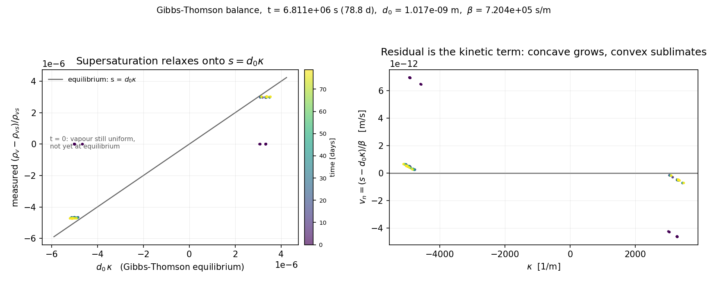

# Where curvature drives interface motion in this model

> **Status: current.** Describes the 2-phase (ice / T / vapour) solver as
> implemented in `src/assembly.c` today. `src/` is byte-identical between
> `enceladus_DSM` and `lunar_regolith_DSM` apart from the main file, so this
> applies to both. Unlike `docs/model_description.md`, nothing here is
> historical.

## The question this answers

Plot the vapour field across a growing interface and you find it
**undersaturated**: $\rho_v < \rho_{vs}(T)$. But the only explicit phase-change
term in the ice equation is

$$S_\mathrm{sub} \;\propto\; (\rho_v - \rho_{vs})$$

which is *negative* there — it says sublimate. Yet the ice grows. And a search
of the source turns up no curvature anywhere in $\rho_{vs}$: `RhoVS_I()` in
`src/material_properties.c` is a pure function of temperature, and the old
`d0_GT` Gibbs–Thomson correction was deleted on 2026-07-21.

So: **where does curvature-driven growth come from, and why is a growing
interface undersaturated?**

Short answer: capillarity is carried by the **Allen–Cahn term**, not by
$\rho_{vs}$. In the sharp-interface limit it produces exactly the
Gibbs–Thomson condition, with a capillary length set by the ratio
$M/\alpha_\mathrm{sub}$. The measured undersaturation *is* $d_0\kappa$. The
interface is at its own local equilibrium, which is depressed below the flat
value — and it grows because $\rho_v$ sits slightly above *that*.

The rest of this document derives that, explains why each step is taken, and
checks every number against a real run.

---

## 1. What is actually in the code

From `src/assembly.c:179` (weak form), the ice residual is

```
R_ice = N*phi_t  +  3*M*eps * grad_N.grad_phi  +  (3*M/eps)*f1 * N
      - (alph_sub/rho_ice) * loc * (rhov - rho_vs) * N
```

Integrating the gradient term by parts and dropping the test function gives the
strong form, which is what we will work with:

$$\boxed{\;\partial_t\phi \;=\; \underbrace{3M\!\left[\varepsilon\nabla^2\phi \;-\; \frac{f_1(\phi)}{\varepsilon}\right]}_{\text{Allen–Cahn}} \;+\; \underbrace{\frac{\alpha_\mathrm{sub}}{\rho_\mathrm{ice}}\,\phi^2(1-\phi)^2\,(\rho_v-\rho_{vs})}_{\text{phase change}}\;}$$

with $M$ = `mob_sub`, and

$$f_1(\phi) \;=\; \phi(1-\phi)(1-2\phi) \;=\; \frac{\mathrm{d}}{\mathrm{d}\phi}\underbrace{\tfrac12\phi^2(1-\phi)^2}_{W(\phi)}.$$

**Two independent things move the interface.** The phase-change term is the one
everybody looks at. The Allen–Cahn term is the one that answers the question,
and it contains no vapour at all.

The factor of $\tfrac12$ in $W$ matters and is deliberate — see the note at
`assembly.c:36`. It is what makes the interface thickness parameter come out as
exactly $\varepsilon$, which is the convention the calibration below assumes.

---

## 2. The equilibrium profile, and why $|\nabla\phi| = \phi(1-\phi)/\varepsilon$

Take a flat, stationary interface with no phase change. Then $\partial_t\phi=0$
and the Allen–Cahn bracket must vanish:

$$\varepsilon^2 f'' \;=\; f_1(f), \qquad \phi = f(s)$$

where $s$ is the coordinate normal to the interface, positive into the ice.
Its solution is the logistic / tanh profile

$$f(s) \;=\; \frac{1}{1+e^{-s/\varepsilon}} \;=\; \tfrac12\!\left(1+\tanh\frac{s}{2\varepsilon}\right),$$

which you can verify directly: $f' = f(1-f)/\varepsilon$, so
$f'' = f'(1-2f)/\varepsilon = f(1-f)(1-2f)/\varepsilon^2$, and multiplying by
$\varepsilon^2$ returns $f_1(f)$ exactly.

**The equipartition relation is the first integral of this equation.** Multiply
$\varepsilon^2f''=f_1(f)$ by $f'$:

$$\frac{\varepsilon^2}{2}\frac{\mathrm{d}}{\mathrm{d}s}\!\left(f'^2\right) = \frac{\mathrm{d}}{\mathrm{d}s}W(f) \quad\Longrightarrow\quad \frac{\varepsilon^2}{2}f'^2 = W(f)$$

(the integration constant is zero because $f'\to0$ and $W\to0$ in the bulk).
With $W=\tfrac12\phi^2(1-\phi)^2$ this is

$$|\nabla\phi| \;=\; f' \;=\; \frac{\phi(1-\phi)}{\varepsilon}.$$

That is the relation used as a diagnostic in
`scripts/paraview_macros/plot_rhovsI.py`. Its physical content is
*equipartition*: gradient energy density equals well energy density everywhere
in the profile. A measured ratio $|\nabla\phi|\varepsilon/[\phi(1-\phi)]$ far
from 1 means the profile is not at equilibrium — driven, or under-resolved.

---

## 3. How curvature enters $\nabla^2\phi$

This is the geometric step. Let $s(\mathbf{x})$ be the signed distance to the
interface, positive into the ice, so $\mathbf{n} = \nabla s$ is the unit normal
pointing into the ice, and by our sign convention

$$\kappa \;=\; -\nabla\!\cdot\!\mathbf{n} \qquad (\kappa>0 \text{ for a convex ice grain}).$$

For any profile $\phi = f(s)$,

$$\nabla\phi = f'\,\mathbf{n}, \qquad \nabla^2\phi = \nabla\!\cdot\!(f'\mathbf{n}) = f''\underbrace{(\nabla s\cdot\mathbf{n})}_{=1} + f'\,\nabla\!\cdot\!\mathbf{n} \;=\; \boxed{f'' - f'\kappa}$$

**This is the decomposition that matters.** The Laplacian splits into

- $f''$ — how the *profile* varies across the interface. Large ($\sim10^{11}$
  for $\varepsilon\!\sim\!1\,\mu$m), and it changes sign at $\phi=0.5$, the
  inflection point of the tanh.
- $-f'\kappa$ — how the *surface* bends. Smaller by a factor
  $\varepsilon\kappa$, and it never changes sign along a given surface.

The geometry is a small perturbation riding on the profile. Any attempt to read
curvature off $\nabla^2\phi$ directly measures the first term, not the second.

---

## 4. Why we expand about the equilibrium profile

Substituting $\phi=f(s)$ into the Allen–Cahn bracket:

$$3M\!\left[\varepsilon(f''-f'\kappa) - \frac{f_1(f)}{\varepsilon}\right] = \underbrace{\frac{3M}{\varepsilon}\left[\varepsilon^2f''-f_1(f)\right]}_{=\;0\ \text{by §2}} \;-\; 3M\varepsilon f'\kappa$$

**The profile equation annihilates the leading term, and what survives is
proportional to $\kappa$.** That is the whole mechanism in one line: an
interface that is locally at its equilibrium profile feels no Allen–Cahn force
*except* through its curvature.

This is legitimate only if the profile really is slaved to the local geometry,
i.e. if the profile relaxes much faster than the interface moves and the band is
thin compared with the radius of curvature. The small parameter is
$\varepsilon\kappa$:

| quantity | wedge run |
|---|---|
| $\varepsilon$ | $8.584\times10^{-7}$ m |
| $|\kappa|$ (max on the contour) | $5.13\times10^{3}$ m$^{-1}$ |
| $\varepsilon\kappa$ | $4.4\times10^{-3}$ |

Four thousandths — the expansion is very well justified here. (It is *not*
automatically justified at a sintering neck, where $\kappa$ can approach
$1/\varepsilon$. See §9.)

---

## 5. The solvability condition — why we multiply by $f'$ and integrate

This is the step that looks like a trick and is not. Here is why it is forced.

Write the expansion $\phi = f(s) + \varepsilon\phi_1 + \dots$ and collect orders.
At leading order we recover $\varepsilon^2f''=f_1(f)$, which defines $f$. At the
next order the correction $\phi_1$ obeys a **linear** equation

$$\mathcal{L}\,\phi_1 \;=\; \mathcal{R}, \qquad \mathcal{L} \;\equiv\; \varepsilon\,\partial_{ss} - \frac{f_1'(f)}{\varepsilon},$$

where $\mathcal{R}$ collects everything left over: the interface motion, the
curvature term from §4, and the phase-change source.

**$\mathcal{L}$ is singular.** Differentiate the profile equation
$\varepsilon^2f''=f_1(f)$ with respect to $s$:

$$\varepsilon^2 f''' = f_1'(f)\,f' \quad\Longleftrightarrow\quad \mathcal{L}f' = 0.$$

So $f'$ is a null eigenvector of $\mathcal{L}$. Its meaning is **translation
invariance**: sliding the profile along $s$ costs nothing, and $f'$ is exactly
the shape of an infinitesimal slide.

$\mathcal{L}$ is self-adjoint under the usual $L^2$ inner product, so by the
Fredholm alternative $\mathcal{L}\phi_1=\mathcal{R}$ has a solution **only if**

$$\int_{-\infty}^{\infty} f'(s)\,\mathcal{R}(s)\,\mathrm{d}s \;=\; 0.$$

That is the solvability condition, and it is the whole reason for the
projection. Physically: any part of the forcing that looks like a rigid
translation of the profile *cannot* be absorbed by deforming the profile — the
interface has to move instead. Projecting onto $f'$ extracts precisely that
part, and the condition that it balance determines the interface velocity.

Everything orthogonal to $f'$ just reshapes the profile slightly and is not our
concern.

### Setting up the projection

Let the interface move with normal velocity $v_n$, defined **positive when ice
grows** (advancing into the air, the $-\mathbf{n}$ direction). A point at fixed
$\mathbf{x}$ then sees $\partial_t s = +v_n$, so

$$\partial_t\phi = f'\,\partial_t s = f'\,v_n .$$

Substituting into the governing equation with §4's result:

$$f'v_n \;=\; -3M\varepsilon f'\kappa \;+\; \frac{\alpha_\mathrm{sub}}{\rho_\mathrm{ice}}\,\mathrm{loc}(f)\,(\rho_v-\rho_{vs}).$$

Now multiply by $f'$ and integrate across the band. $(\rho_v-\rho_{vs})$ comes
out of the integral because the band is thin compared with the vapour diffusion
length, so $\rho_v$ is effectively constant across it — the standard
inner-region approximation:

$$v_n\!\int\! f'^2\,\mathrm{d}s \;=\; -3M\varepsilon\kappa\!\int\! f'^2\,\mathrm{d}s \;+\; \frac{\alpha_\mathrm{sub}}{\rho_\mathrm{ice}}(\rho_v-\rho_{vs})\!\int\!\mathrm{loc}\,f'\,\mathrm{d}s.$$

---

## 6. The two integrals

Both are elementary once you change variable from $s$ to $\phi$ using
$\mathrm{d}s = \mathrm{d}\phi/f'$ with $f'=\phi(1-\phi)/\varepsilon$:

$$\int f'^2\,\mathrm{d}s = \int_0^1 f'\,\mathrm{d}\phi = \frac{1}{\varepsilon}\int_0^1\phi(1-\phi)\,\mathrm{d}\phi = \frac{1}{6\varepsilon}$$

$$\int \mathrm{loc}\,f'\,\mathrm{d}s = \int_0^1 \phi^2(1-\phi)^2\,\mathrm{d}\phi = B(3,3) = \frac{1}{30}$$

Their ratio is $\varepsilon/5$ — and that $5$ is where the code's `a1` comes
from (§7). Substituting:

$$\boxed{\;v_n \;=\; -3M\varepsilon\,\kappa \;+\; \frac{\varepsilon\,\alpha_\mathrm{sub}}{5\rho_\mathrm{ice}}\,(\rho_v-\rho_{vs})\;}$$

Read it directly:

- **$\kappa<0$ (concave ice — a pore wall, a neck) $\Rightarrow$ $v_n>0$: the
  ice grows**, with no vapour driving force at all.
- **$\kappa>0$ (convex ice — a grain) $\Rightarrow$ $v_n<0$: it shrinks.**
- Supersaturation adds to growth in the obvious way.

That first term is classical motion by mean curvature, and it is the answer to
"where does curvature drive interface motion".

---

## 7. The Gibbs–Thomson condition falls out

Rearrange for the vapour density instead of the velocity. Divide by $\rho_{vs}$
and define the relative supersaturation $s \equiv (\rho_v-\rho_{vs})/\rho_{vs}$:

$$\boxed{\;s \;=\; d_0\,\kappa \;+\; \beta\,v_n\;}$$

$$d_0 = \frac{15\,M\,\rho_\mathrm{ice}}{\alpha_\mathrm{sub}\,\rho_{vs}}, \qquad \beta = \frac{5\,\rho_\mathrm{ice}}{\varepsilon\,\alpha_\mathrm{sub}\,\rho_{vs}}$$

This is the **Gibbs–Thomson condition with kinetic undercooling**, and it was
never written anywhere in the code. It is a property of the Allen–Cahn term.
Setting $v_n=0$ gives the equilibrium statement

$$\rho_v^\mathrm{eq} = \rho_{vs}(T)\,\bigl(1 + d_0\kappa\bigr),$$

i.e. a concave surface has a *depressed* equilibrium vapour density and a convex
one an elevated one — exactly the classical result.

### This matches the code's own calibration exactly

`src/enceladus_main.c:761-769` sets

```c
PetscReal a1 = 5.0, a2 = 0.1581;   /* Constants for GT relation */
d0_sub     = user.d0_sub0 / rho_rhovs;      /* rho_rhovs = rho_ice/rho_vs */
lambda_sub = a1 * user.eps / d0_sub;
```

and preserves `alph_sub/mob_sub = 3*lambda_sub/eps` (`enceladus_main.c:729`).
Chaining those:

$$\frac{\alpha_\mathrm{sub}}{M} = \frac{3\lambda}{\varepsilon} = \frac{3a_1}{d_{0,\mathrm{sub}}} \quad\Longrightarrow\quad d_{0,\mathrm{sub}} = \frac{3a_1 M}{\alpha_\mathrm{sub}} \overset{a_1=5}{=} \frac{15M}{\alpha_\mathrm{sub}}$$

and multiplying by $\rho_\mathrm{ice}/\rho_{vs}$ returns exactly the $d_0$
derived above. **The `a1 = 5.0` in the code is the
$\int f'^2 / \int\mathrm{loc}\,f'$ ratio of §6.** Numerically, for the wedge run:

| | value |
|---|---|
| $d_0 = 15M\rho_\mathrm{ice}/(\alpha_\mathrm{sub}\rho_{vs})$, from the run's $M$, $\alpha_\mathrm{sub}$ | $1.0166\times10^{-9}$ m |
| `d0_sub0` printed in the run's `outp.txt` | $1.0166\times10^{-9}$ m |
| physical $\gamma V_m/(R_gT)$ at $-20^\circ$C (`preprocess/comp_eps.py`) | $1.0168\times10^{-9}$ m |
| $\beta = 5\rho_\mathrm{ice}/(\varepsilon\alpha_\mathrm{sub}\rho_{vs})$ | $7.204\times10^{5}$ s/m |

Agreement to five decimal places, and the value is the physical capillary
length. The calibration is doing what it claims.

### $\beta$ needs one more term than this derivation produces

$d_0$ comes out exact, but the kinetic coefficient does not, and it is worth
being precise about why. The code builds (`enceladus_main.c:770`)

```c
tau_sub  = eps*lambda_sub*( beta_sub/a1 + a2*eps/diff_sub + a2*eps/dif_vap );
mob_sub  = eps/(3*tau_sub);
alph_sub = lambda_sub/tau_sub;
```

Substituting into $\beta = 5\rho_\mathrm{ice}/(\varepsilon\alpha_\mathrm{sub}\rho_{vs})$ and using $a_1=5$:

$$\beta_{\text{(this derivation)}} \;=\; \beta_0 \;+\; 5a_2\,\varepsilon\!\left(\frac{1}{D_\mathrm{sub}}+\frac{1}{D_\mathrm{vap}}\right)\!\frac{\rho_\mathrm{ice}}{\rho_{vs}}$$

| | value |
|---|---|
| $\beta$ from §7 (leading order) | $7.2036\times10^{5}$ s/m |
| `-beta_sub0` the run targets | $5.9216\times10^{5}$ s/m |
| difference | $1.2820\times10^{5}$ s/m |
| implied $1/D_\mathrm{sub}$, given $D_\mathrm{vap}=2.178\times10^{-5}$ | $\Rightarrow D_\mathrm{sub} = 7.7785\times10^{-6}$ m$^2$/s |
| `diff_sub` = $\tfrac12(k_a/\rho_ac_{p,a} + k_i/\rho_ic_{p,i})$, `enceladus_main.c:717` | $7.78\times10^{-6}$ m$^2$/s |

The budget closes to four digits. Those $a_2$ terms are the **thin-interface
correction**: the projection in §5 is an inner-region calculation, and it does
not see the diffusion field in the outer region, which also resists interface
motion. The code subtracts that resistance when building $\tau$ so the
*effective* kinetic coefficient lands on the requested $\beta_0$.

This matters for reading §8: $a_2$ enters $\beta$ only, never $d_0$, so the
$s = d_0\kappa$ comparison is unaffected. But velocities inferred as
$v_n=(s-d_0\kappa)/\beta$ with the leading-order $\beta$ are systematically
**~22% low**. Their signs and relative magnitudes are right; treat the absolute
numbers as order-of-magnitude.

---

## 8. Verification against a real run

`postprocess/gt_balance.py` tests $s = d_0\kappa + \beta v_n$ directly. It reads
$M$, $\alpha_\mathrm{sub}$, $\rho_\mathrm{ice}$, $\varepsilon$ out of the run's
own `outp.txt`, samples the $\phi=0.5$ contour, and takes $\kappa$ from the same
Programmable Filter that `scripts/paraview_macros/plot_rhovsI.py` builds.

```bash
/Applications/ParaView-6.1.1.app/Contents/bin/pvpython \
    postprocess/gt_balance.py <run_dir> --out docs/figures
```



Run: `lunar_regolith_DSM/batch_2026-08-07__07.26.38_wedge_bc/2D_wedge_band_90deg__Tgrad_T-20_G0_90d_rhov_eq_eq`,
5702 contour points pooled over 8 timesteps.

**Left panel.** Measured supersaturation against $d_0\kappa$, coloured by time.
The grey line is $s = d_0\kappa$, the equilibrium prediction — no fit, no free
parameter. At $t=0$ (dark points) the vapour is initialized uniform, so $s=0$
while $\kappa$ is already set by the initial geometry: the interface starts
*far* from Gibbs–Thomson equilibrium. It then **relaxes onto the line**. That
relaxation is the evidence the condition is emergent rather than imposed —
nothing in the code puts it there.

| median $|s - d_0\kappa| / |d_0\kappa|$ | |
|---|---|
| at $t=0$ | 1.000 (entirely off equilibrium) |
| at $t=90$ d | 0.103 |

**Right panel.** The residual, converted to velocity via $v_n=(s-d_0\kappa)/\beta$.
The sign is consistent across all 5702 points:

| | median $v_n$ |
|---|---|
| concave ($\kappa<0$) | $+5.20\times10^{-13}$ m/s — **growing** |
| convex ($\kappa>0$) | $-4.97\times10^{-13}$ m/s — **sublimating** |

(These use the leading-order $\beta$ and are therefore ~22% low in absolute
terms — see §7. The signs, which are the point, are unaffected.)

Mass moving from convex to concave, at a few µm over the 90-day run. That is
curvature-driven transfer, working as intended.

---

## 9. Resolving the original paradox

For the concave (growing) surface of the wedge:

| | |
|---|---|
| $\kappa$ | $-4965$ m$^{-1}$ |
| local equilibrium $d_0\kappa$ | $-5.05\times10^{-6}$ |
| measured $s$ | $-4.71\times10^{-6}$ |
| residual $=\beta v_n$ | $+3.4\times10^{-7}$ |

The vapour *is* undersaturated relative to a **flat** ice surface — that reading
was correct. But the relevant comparison is against the **local** equilibrium,
which curvature has depressed to $-5.05\times10^{-6}$. Measured against that,
$\rho_v$ is *super*saturated by $+3.4\times10^{-7}$, and the ice grows.

The explicit $S_\mathrm{sub}$ term is indeed negative there. It is *not* the
term doing the growing: the Allen–Cahn term is, and $S_\mathrm{sub}$ partially
opposes it. The balance between them is what holds $\rho_v$ near
$\rho_{vs}(1+d_0\kappa)$ in the first place.

---

## 10. Consequences

### Do not add an explicit $d_0^\mathrm{GT}\kappa$ term to `RhoVS_I`

It would **double-count** capillarity. The Allen–Cahn term already supplies it,
calibrated to the physical $d_0$ through `d0_sub0`. This reframes the `d0_GT`
field deleted on 2026-07-21: it was a *second*, independent capillarity stacked
on top of the one the asymptotics already provide.

If capillarity ever needs to be strengthened or weakened deliberately, the lever
is `-d0_sub0` (which moves $M/\alpha_\mathrm{sub}$), not a new term.

### `Supersaturation_GT` is the interface-velocity field

`plot_rhovsI.py` computes
$(\rho_v-\rho_{vs}^\mathrm{eff})/\rho_{vs}^\mathrm{eff}$ with
$\rho_{vs}^\mathrm{eff}=\rho_{vs}(1+d_0\kappa)$ — which to first order is
$s - d_0\kappa = \beta v_n$. So it is proportional to local normal velocity:
**positive means growing, negative means sublimating**, with the capillary
background divided out. Plain `Supersaturation` is dominated by $d_0\kappa$ and
therefore mostly shows you a curvature map, which is what made the original
observation look contradictory.

### Where this derivation stops being valid

- **$\varepsilon\kappa$ not small.** The expansion in §4 assumes the band is
  thin against the radius of curvature. At a sintering neck $\kappa$ can
  approach $1/\varepsilon$ and the sharp-interface condition stops describing
  the model. This is the same limit as the neck-resolution floor
  $r/R > \sqrt{12\varepsilon/R}$.
- **Profile not at equilibrium.** §2's $f$ underlies every integral in §6. The
  equipartition ratio printed by `plot_rhovsI.py` is the direct check — it is
  1.041 (p10 0.99, p90 1.07) on the wedge run, so the assumption holds there to
  a few percent.
- **Under-resolution.** With $\mathrm{d}x/\varepsilon = 0.71$ on this run, the
  measured $\kappa$ itself carries ~3.5% error (see
  `scripts/paraview_macros/verify_curvature.py`), which propagates straight into
  $d_0\kappa$.
- **The $\xi_v$ temporal scaling** slows vapour diffusion by $10^{3}$ here. It
  cancels between diffusion and source in the quasi-steady limit, but it does
  change how fast $\rho_v$ relaxes onto the Gibbs–Thomson value — which is why
  the $t=0$ transient in §8 is visible at all.

---

## 11. Reference

| symbol | meaning | source |
|---|---|---|
| $M$ | `mob_sub`, Allen–Cahn mobility [m/s] | derived at startup |
| $\alpha_\mathrm{sub}$ | `alph_sub`, phase-change rate [1/s] | derived at startup |
| $\varepsilon$ | interface decay length [m] | `-eps` |
| $d_0$ | capillary length, $15M\rho_\mathrm{ice}/(\alpha_\mathrm{sub}\rho_{vs})$ | `-d0_sub0` |
| $\beta$ | kinetic coefficient, $5\rho_\mathrm{ice}/(\varepsilon\alpha_\mathrm{sub}\rho_{vs})$ | `-beta_sub0` |
| $\kappa$ | $-\nabla\!\cdot\!\mathbf{n}$, positive on convex ice | post-processing only |

Code: `src/assembly.c:179` (residual), `src/assembly.c:36` (well
normalisation), `src/enceladus_main.c:761` (`a1`, $\lambda$, $d_0$).
Tools: `postprocess/gt_balance.py`,
`scripts/paraview_macros/plot_rhovsI.py`,
`scripts/paraview_macros/verify_curvature.py`.
