# k_eff on a diffuse interface: finding and removing the interface bias

Seven slides plus two backup slides (4b, 7b), written for an audience outside phase-field
modelling.

- **Figures** are in `figures/` as 300 dpi PNG and vector PDF. Each panel is
  sized to fill half of a 16:9 slide.
- **Equations** are fenced `latex` blocks. Each is one display expression with
  no custom macros, so it can be pasted straight into IguanaTeX.
- **Rebuilding:** `make_figures.py` rebuilds every figure. `pilot_rewiden.py`
  regenerates the packing data behind slides 1b and 7b; slide 7 is built from the PetIGA replay CSVs.
- **Numbers:** every number quoted here comes from a committed CSV or script.
  The source is given next to it.

**Colours are the same on every slide:**

| colour | means |
|---|---|
| orange | arithmetic law (the old law) |
| blue | tensor law (the new law) |
| black / dashed black | exact, sharp-interface answer |
| green | a thresholded geometry (slide 7 only) |

---

## Slide 1: How we found the bias

**Figures (side by side):**

| (a) Benchmark: flat ice slab | (b) Real microstructure: pilot packing |
|---|---|
| 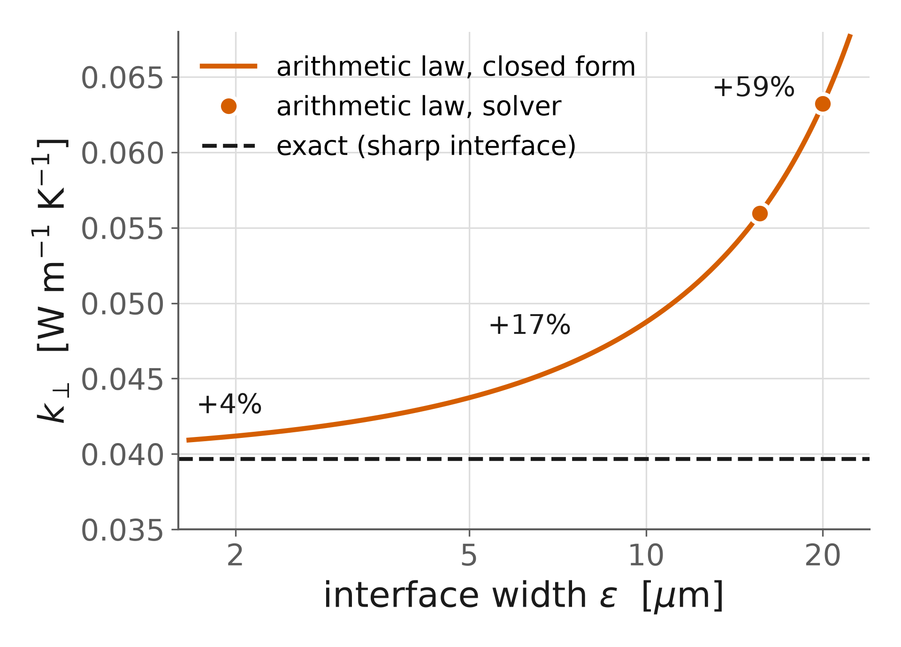 | 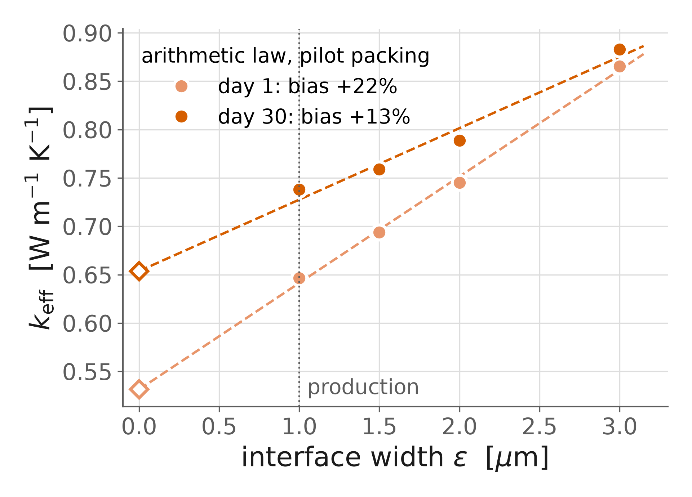 |

**On-slide text**

- **Flat ice slab:** heat flowing across the layers reads **too high**, and the
  error shrinks as the interface gets sharper, approaching the exact value from
  above: **+59% → +17% → +4%**.
- **The same thing appears on the real packing:** k_eff rises linearly as the interface is
  widened. Extrapolating to a sharp interface puts the production value
  **+22% too high at day 1 and +13% at day 30**.
- **The bias changes over time**, so it does not cancel in k(t)/k(0), the
  quantity the campaign reports.

**Talking points**

1. The first signal came from a validation benchmark, not from theory. The
   slab has an exact answer. The direction parallel to the layers matched it
   at every interface width, but the direction across the layers was always
   too high, and the error grew with ε.
2. ε is purely numerical. The physical answer is the ε → 0 limit, so any
   dependence on ε is an error.
3. Panel (b) uses no new simulations. The stored phase field is
   `φ = σ(s/ε)`, which can be inverted exactly to the signed distance `s` and
   re-evaluated at a larger ε. That gives the same geometry with a wider
   interface. k_eff is linear in ε, and the intercept is the sharp-interface
   estimate.
4. **Why this matters:** the bias scales with ε × interface area. Sintering
   destroys interface area (SSA falls about 37% over 30 d), so the bias
   shrinks during a run. The measured k(30 d)/k(1 d) is therefore wrong, not
   just offset.
5. The rise is the number that matters. From day 1 to day 30 the arithmetic
   law measures +14%, and the extrapolation to ε → 0 gives +23%. The tensor
   law, computed directly on the same snapshots, gives +22.5% (slide 7), which
   agrees with the extrapolated value. The linear extrapolation is rougher for
   the day-1 level itself: it gives 0.531, against 0.571 from the tensor law.
6. Caveat: the ladder in (b) can only widen the interface, because the output
   grid is coarser than the solve grid, so the intercept is an extrapolation.
   Slides 3 and 6 are the clean test.

*Sources:* (a) is the closed form in
`studies/keff_sharp_limit/verification/keff_laminate_analytic.py`, with solver
points from the `-keff_interp arith` laminate runs. (b) is
`pilot_rewiden.csv` (pilot seed 1, the 945² output grid, python
finite-volume cell solver).

---

## Slide 2: The test problem

**Figures (side by side):**

| (a) Sharp interface: what the exact solution sees | (b) Diffuse interface: what our model sees |
|---|---|
| 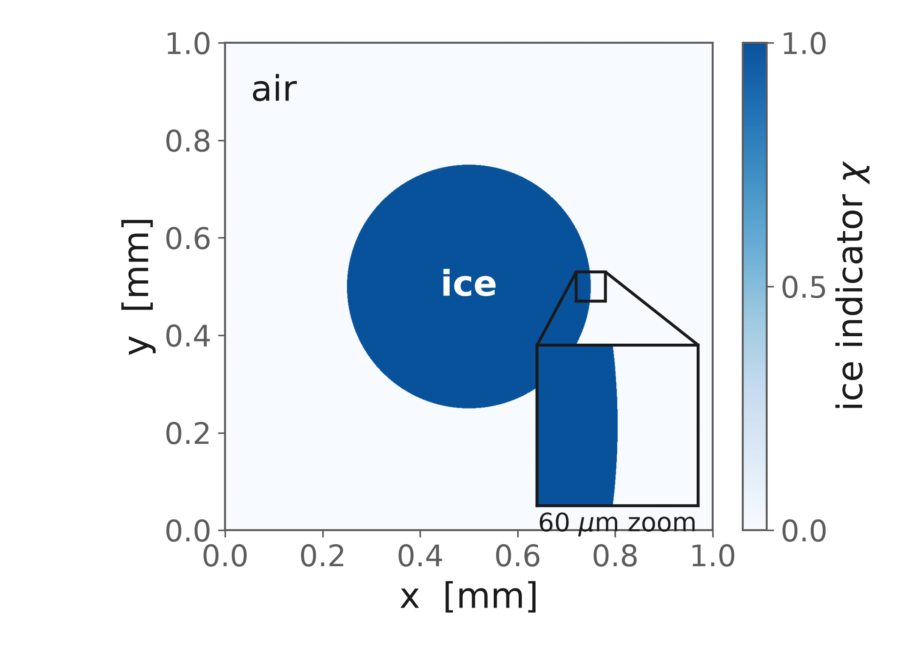 | 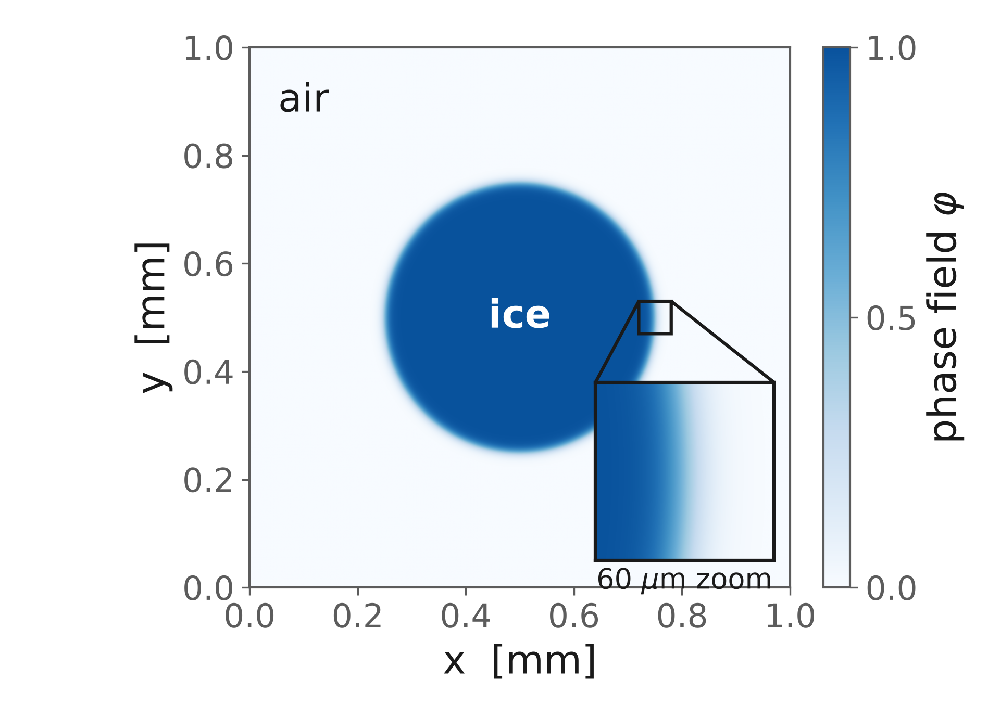 |

Optional third figure, for a small inset or a backup slide:
`figures/fig2c_profile.png`, the 1-D profile across the interface.

**On-slide text**

The test case is a single ice disk (R = 250 µm) in a 1 mm periodic cell, which
is a square array of disks, ice fraction f = 0.196. The diffuse version is
shown at the production resolution, ε/R = 0.02.

The PDE we solve is the cell problem of Calonne et al. (2011), on the phase field:

```latex
\nabla\cdot\Big(\mathbf{K}(\varphi)\,\big(\nabla t_m+\mathbf{e}_m\big)\Big)=0
\quad\text{in the periodic cell},\qquad m=1,2
```

```latex
\mathbf{K}_{\mathrm{eff}}\,\mathbf{e}_m=\frac{1}{|\Omega|}\int_\Omega \mathbf{K}(\varphi)\,\big(\nabla t_m+\mathbf{e}_m\big)\,d\Omega
```

The old (arithmetic) law, the same in every direction:

```latex
K(\varphi)=K_a+(K_i-K_a)\,\varphi,\qquad K_i=2.29,\;\;K_a=0.02\ \mathrm{W\,m^{-1}K^{-1}}
```

The diffuse interface profile:

```latex
\varphi=\tfrac12\Big[1+\tanh\!\Big(\frac{s}{2\varepsilon}\Big)\Big]
```

The exact answer for the sharp disk array (Rayleigh 1892, in the form of
Perrins et al. 1979), with β = (K_i − K_a)/(K_i + K_a) and T = −1/β:

```latex
\frac{k}{K_a}=1-\frac{2f}{T+f-\dfrac{0.305827\,f^{4}\,T}{T^{2}-1.402958\,f^{8}}-0.013362\,f^{8}}
```

**Talking points**

1. Why a disk: it has an exact answer, and its interface points in every
   direction. The slab only tests one direction.
2. The sharp and diffuse problems use the same PDE and the same K law. The only
   difference is that K sees φ, a smooth ramp, instead of χ, a 0/1 step. If
   the answers differ, the difference comes from how K is interpolated inside
   the ramp.
3. The interface is thin: at ε/R = 0.02 the visible band (about 9ε, from 1%
   to 99%) is 45 µm on a 250 µm disk. The inset zoom shows it.
4. These are single steady-state solves (`-keff_only`). There is no time
   integration, and nothing evolves.

---

## Slide 3: The bias is large, and it depends on the geometry

**Figures (side by side):**

| (a) k_eff vs ice fraction | (b) error vs ice fraction |
|---|---|
| 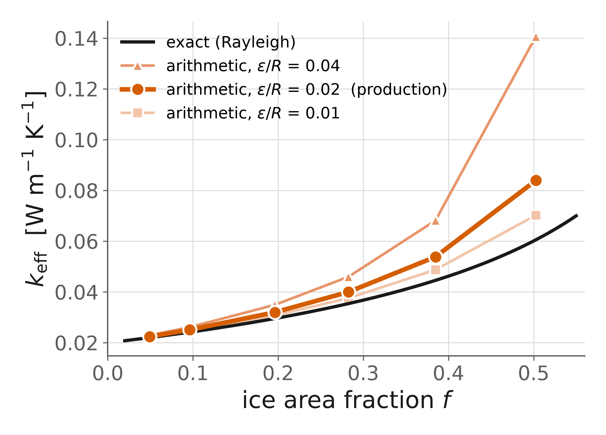 | 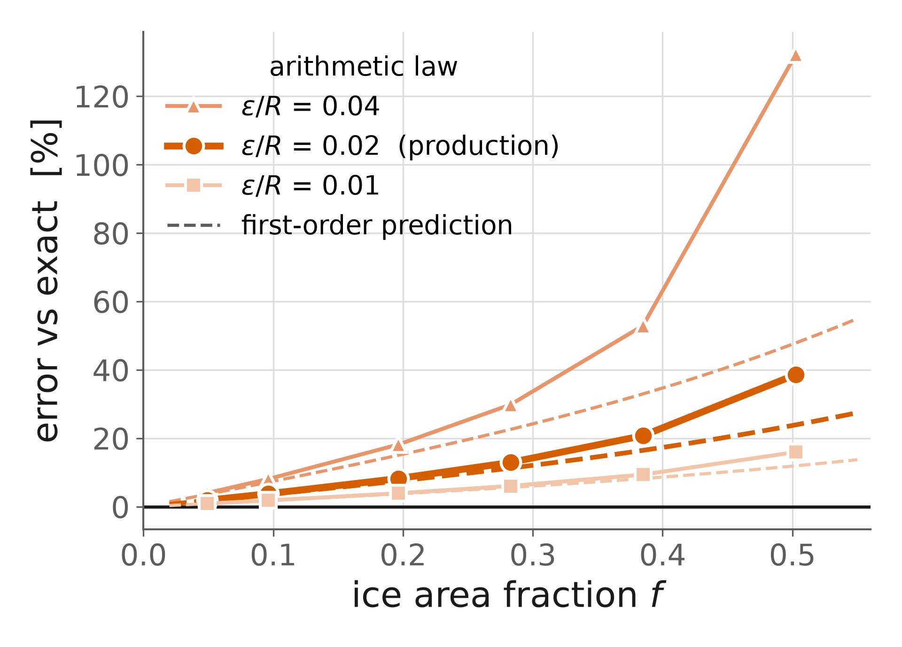 |

**On-slide text**

- The test covers six disk sizes (f = 0.05 to 0.50) at three interface widths. The bold curve is our
  production resolution, ε/R = 0.02.
- The arithmetic law always reads **high**.
- At production resolution the error grows from **+1.9% at f = 0.05 to +38.6% at
  f = 0.50**. At twice the width it reaches +132%, more than double the true value.
- **It is not a constant offset.** It grows with the ice fraction, so it
  changes as the microstructure evolves.

Measured error against Rayleigh's exact answer, arithmetic law:

| f | 0.05 | 0.10 | 0.20 | 0.28 | 0.39 | 0.50 |
|---|---|---|---|---|---|---|
| ε/R = 0.04 | +4.0% | +8.1% | +18.2% | +29.8% | +53.0% | +132% |
| **ε/R = 0.02** | **+1.9%** | **+3.8%** | **+8.3%** | **+13.0%** | **+20.8%** | **+38.6%** |
| ε/R = 0.01 | +0.9% | +1.9% | +4.0% | +6.1% | +9.4% | +16.0% |

**Talking points**

1. **Why plot against f instead of showing one point:** one point shows the
   bias exists. A sweep shows its size depends on the microstructure. If every
   geometry were, say, 8% too high, ratios like k(t)/k(0) would still be right.
   Because the error depends on geometry, and sintering changes the geometry,
   the ratios are wrong too.
2. Each curve holds ε/R fixed, which is how production runs are resolved
   (ε = 1 µm on R_ave = 50 µm). The bold curve therefore *is* our
   production resolution applied to every disk size.
3. Panel (b): the dashed lines are the first-order theory of slide 4, with no
   fitted constants.
   - It matches the data at low f: at f = 0.196, +7.5% predicted against +8.3%
     measured.
   - It *under*-predicts as the disks crowd together: at f = 0.50, +24%
     predicted against +39% measured. The theory uses a single disk's field,
     but neighbours squeeze the heat through the gaps, and the gaps are where
     the band shorts the air.
   - The pilot packing is denser still, at an ice fraction of about 0.68, so
     this is the regime we are in.
4. Halving ε roughly halves the error, which is what a first-order error does.
   But the cost grows as 1/ε² in 2-D, and more steeply in 3-D. Refining the
   mesh is not a practical fix.

*Source:* `studies/keff_sharp_limit/disk_sweep/keff_disk_sweep.csv`: 36
`-keff_only` PetIGA runs, HPC batch `batch_2026-09-24__14.23.15_keff_disk_fsweep`,
all collector checks passed.

---

## Slide 4: Where the bias comes from

**Figures (side by side):**

| (a) Across the interface: resistances in series | (b) Along the interface: conductances in parallel |
|---|---|
| 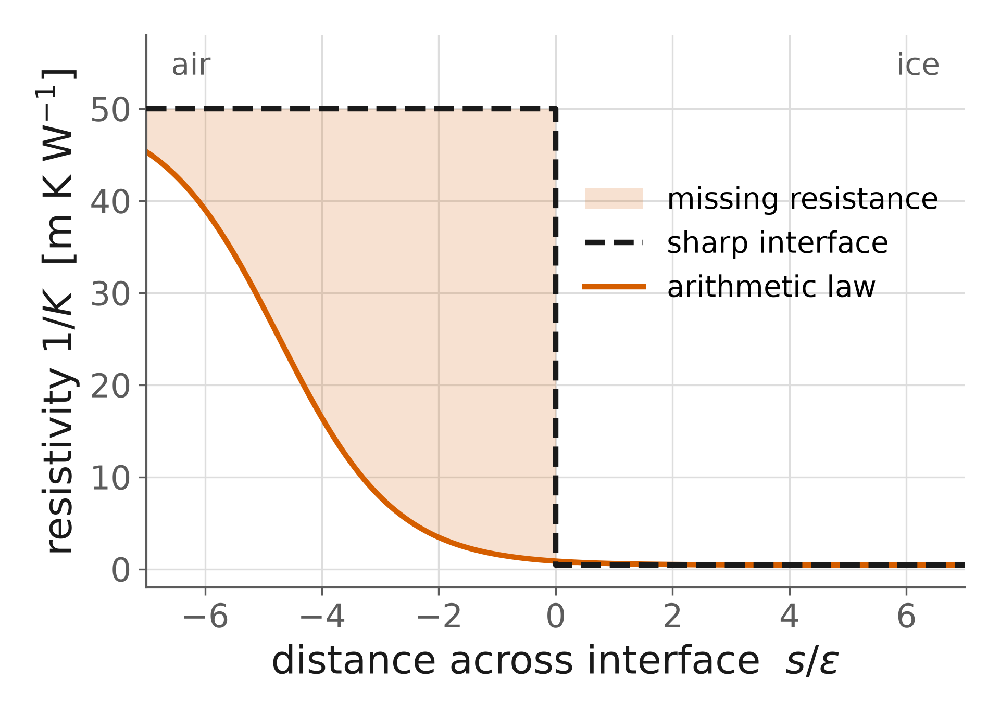 | 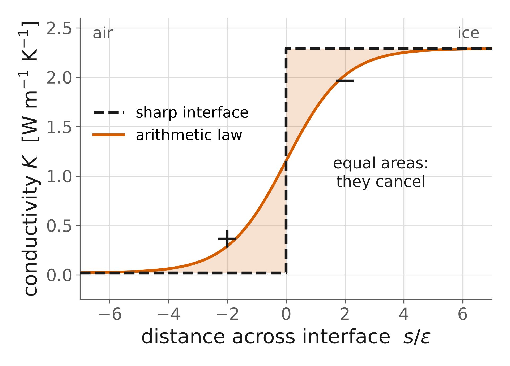 |

**On-slide text**

- Inside the thin band, two quantities stay fixed, just as at a sharp interface: the
  **heat flux across** the band and the **temperature gradient along** it.
- **Across:** heat passes through the band layer after layer, so the
  *resistances* 1/K add. Under the arithmetic law the band has much **less
  resistance** than the sharp interface (panel a, shaded). The result is a
  **thermal short circuit** at every interface.
- **Along:** the layers carry heat side by side, so the *conductances* K
  add. The arithmetic law gets this right: the two lobes cancel (panel b).

To first order in ε, the band behaves like a sharp interface that carries two
spurious terms:

```latex
[\![T]\!]=\Sigma_n\,q_n,\qquad \Sigma_n=\varepsilon\int_{-\infty}^{\infty}\Big[\frac{1}{K_n(\varphi(u))}-\frac{1}{K_n(H(u))}\Big]\,du
```

```latex
[\![q_n]\!]=-\nabla_\Gamma\cdot\big(\Sigma_t\,\nabla_\Gamma T\big),\qquad \Sigma_t=\varepsilon\int_{-\infty}^{\infty}\Big[K_t(\varphi(u))-K_t(H(u))\Big]\,du
```

For the arithmetic law:

```latex
\Sigma_t=0,\qquad \Sigma_n=-\varepsilon\Big(\frac{1}{K_a}-\frac{1}{K_i}\Big)\ln\frac{K_i}{K_a}\;=\;-235\,\varepsilon\ \ \mathrm{m\,K\,W^{-1}}
```

and the resulting error in k_eff:

```latex
\Delta k=\frac{1}{|\Omega|}\int_\Gamma\Big(\Sigma_t\,|\mathbf{E}_t|^2-\Sigma_n\,q_n^{2}\Big)\,d\Gamma+O(\varepsilon^2)\;>\;0
```

**Talking points**

1. Σ_n and Σ_t are the shaded areas in the two panels, multiplied by ε. They
   are the net excess resistance across the band and the net excess
   conductance along it, compared with a sharp step.
2. Σ_t = 0 comes from symmetry. The tanh profile is antisymmetric about its midpoint, so
   anything linear in φ gains on one side exactly what it loses on the other.
   The arithmetic K is linear in φ.
3. Σ_n ≠ 0 because 1/K is *not* linear in φ: it is convex. With a
   115× contrast the air-side deficit is huge (panel a).
4. The error is proportional to ε × interface area × (normal flux)². That is
   where "linear in ε" (slide 6b) and "depends on geometry" (slide 3) both
   come from.
5. **No scalar law can fix both.** Σ_t = 0 needs K linear in φ. Σ_n = 0 needs 1/K
   linear in φ. Only a constant satisfies both.

*Backup slide 4b has the derivation.*

---

## Slide 4b (backup): How Σ_n and Σ_t are derived

Following `effective_thermal_cond/docs/tensor_conductivity_law.tex` §4–5.
The planar version of steps 3–6 is exactly Nicoli, Plapp & Henry (2011),
§II.B–C: their surface conductivity M_s (eq. 7) is our Σ_t, and their
interface resistance R_s (eq. 15) is our Σ_n. The constant-flux-across and constant-gradient-along structure in steps 2–3
is the same one that gives the laminate formulas in Milton (2002, §9.2).

*Citation footer for the slide:* Nicoli, Plapp & Henry (2011) · Karma &
Rappel (1998) · Milton (2002), §9.2
The method is a matched asymptotic expansion, the standard thin-interface
analysis of phase-field models (Karma & Rappel 1998; for unequal
conductivities, Almgren 1999; McFadden et al. 2000).

**Step 1: zoom into the band.** Let s be the signed distance to the interface
and u = s/ε. With curvature κ, the PDE in band coordinates is:

```latex
\varepsilon^{-2}\,\partial_u\big(K_n\,\partial_u T\big)+\varepsilon^{-1}\kappa\,K_n\,\partial_u T+\nabla_{\mathbf y}\cdot\big(K_t\,\nabla_{\mathbf y}T\big)+O(\varepsilon)=0
```

**Step 2: order ε⁻².** T does not vary across the band, so the tangential gradient is the same throughout it:

```latex
\partial_u\big(K_n\,\partial_u T_0\big)=0\;\Rightarrow\;T_0=T_0(\mathbf y),\qquad \mathbf{E}_t=\nabla_{\mathbf y}T_0\ \text{constant across the band}
```

**Step 3: order ε⁻¹.** The normal flux is the same at every point across the band:

```latex
K_n(\varphi(u))\,\partial_u T_1=q_n(\mathbf y)\;\Rightarrow\;\partial_s T=\frac{q_n}{K_n(\varphi)}
```

**Step 4: the temperature drop across the band.** Integrate ∂_s T and subtract
what the sharp interface gives (slope q_n/K_i on the ice side, q_n/K_a on the
air side). What remains is a spurious jump, an extra series resistance:

```latex
[\![T]\!]=q_n\int_{-\infty}^{\infty}\Big[\frac{1}{K_n(\varphi)}-\frac{1}{K_n(H)}\Big]\,ds\;\equiv\;\Sigma_n\,q_n
```

**Step 5: the flux carried along the band.** Integrate the O(1) equation across
the band. The band carries an extra tangential flux, which appears as a jump in
the normal flux:

```latex
[\![q_n]\!]=-\nabla_\Gamma\cdot\Big(\nabla_\Gamma T\int_{-\infty}^{\infty}\big[K_t(\varphi)-K_t(H)\big]\,ds\Big)\;\equiv\;-\nabla_\Gamma\cdot\big(\Sigma_t\nabla_\Gamma T\big)
```

**Step 6: evaluate the integrals.** Antisymmetry of the profile kills every
quantity that is linear in φ:

```latex
\varphi(-u)=1-\varphi(u)\;\Rightarrow\;\int_{-\infty}^{\infty}\big[\varphi(u)-H(u)\big]\,du=0\;\Rightarrow\;\Sigma_t^{\mathrm{arith}}=0
```

1/K is not linear in φ. Substitute p = φ(u), use dφ/du = φ(1−φ), and apply
partial fractions:

```latex
\frac{\Sigma_n}{\varepsilon}=\int_0^{1/2}\Big[\frac{1}{K(p)}-\frac{1}{K_a}\Big]\frac{dp}{p(1-p)}+\int_{1/2}^{1}\Big[\frac{1}{K(p)}-\frac{1}{K_i}\Big]\frac{dp}{p(1-p)}=-\Big(\frac{1}{K_a}-\frac{1}{K_i}\Big)\ln\frac{K_i}{K_a}
```

**Step 7: the effect on k_eff.** The first-order correction to the temperature
field solves the sharp problem with these two jumps. Two applications of the
divergence theorem give Δk, the last equation on slide 4. The first-order
theory is then **complete**: the diffuse problem reproduces the sharp one to
O(ε²) *if and only if* Σ_n = Σ_t = 0.

*Checks:* both closed forms match direct quadrature (the normal one to 12
digits). The disk-array slope predicted from Δk matches the measured slope to
1.9% with no fitted constants (`studies/keff_sharp_limit/disk/README.md`).

---

## Slide 5: The fix, a tensor conductivity law

**Figures (side by side):**

| (a) What the new K looks like across the interface | (b) Across the interface, the lobes now cancel |
|---|---|
| 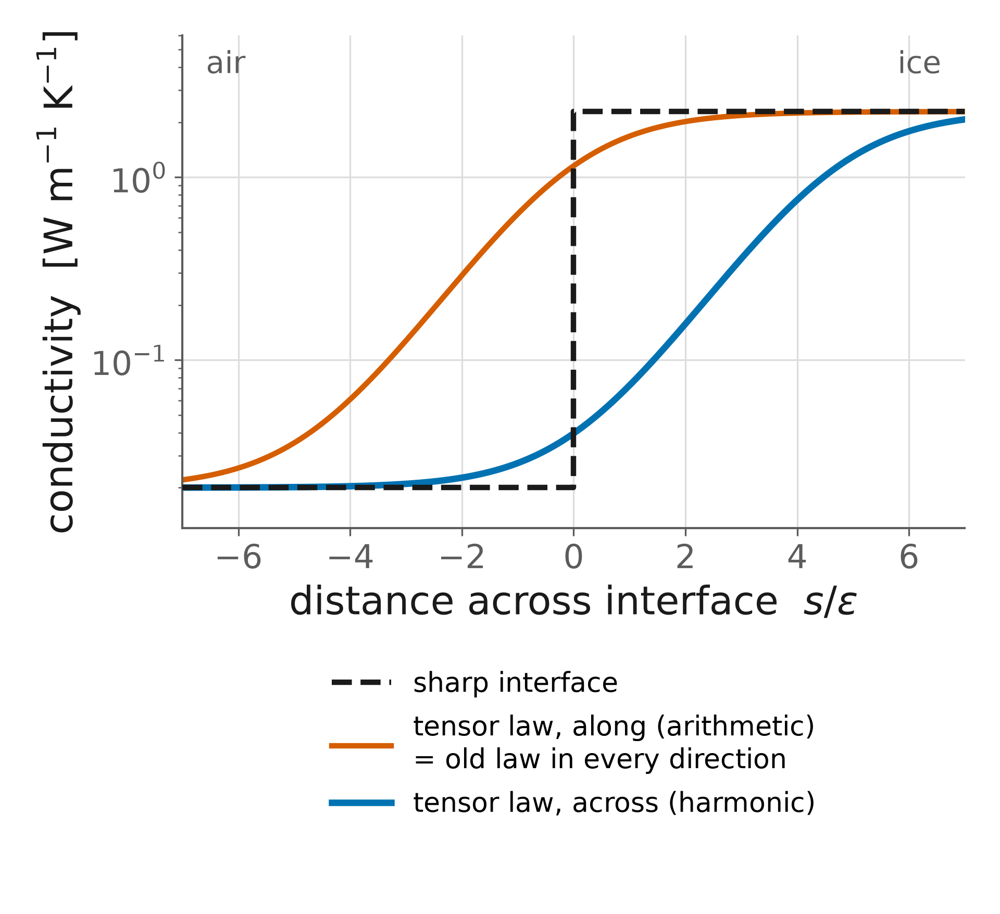 | 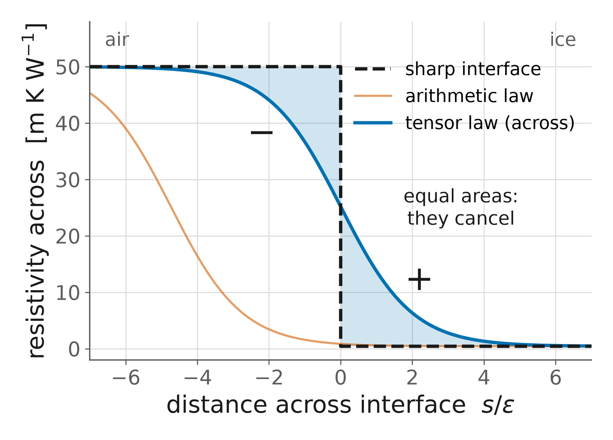 |

Optional third figure, the intuition: `figures/fig5c_layer_schematic.png`.

**On-slide text**

- Use each average where the physics calls for it: **arithmetic along the
  interface, harmonic across it**. The interface normal comes from ∇φ.
- Both spurious terms then vanish: **Σ_t = Σ_n = 0**, and the error drops to O(ε²).
- There are no fitted parameters. Outside the band the law reduces to the pure-phase values,
  so the sharp limit is unchanged.
- *Citation footer for the slide:* Nicoli, Plapp & Henry (2011) *Phys. Rev. E*
  84, 046707 · Ettrich et al. (2014) *MSMSE* 22, 085006 · Milton (2002)
  *The Theory of Composites*, §9.2

```latex
\mathbf{K}(\varphi,\nabla\varphi)=\underbrace{\big[K_a+(K_i-K_a)\varphi\big]}_{K_t\ \text{(arithmetic)}}\big(\mathbf I-\hat{\mathbf n}\otimes\hat{\mathbf n}\big)+\underbrace{\Big[\frac{\varphi}{K_i}+\frac{1-\varphi}{K_a}\Big]^{-1}}_{K_n\ \text{(harmonic)}}\hat{\mathbf n}\otimes\hat{\mathbf n},\qquad \hat{\mathbf n}=\frac{\nabla\varphi}{|\nabla\varphi|}
```

In 2-D, with n̂ = (cos θ, sin θ):

```latex
\mathbf{K}=\begin{pmatrix}K_t\sin^2\theta+K_n\cos^2\theta & (K_n-K_t)\sin\theta\cos\theta\\ (K_n-K_t)\sin\theta\cos\theta & K_t\cos^2\theta+K_n\sin^2\theta\end{pmatrix}
```

Why both terms vanish (1/K_n and K_t are both linear in φ):

```latex
\frac{1}{K_n}=\frac{\varphi}{K_i}+\frac{1-\varphi}{K_a}\ \text{linear in }\varphi\;\Rightarrow\;\Sigma_n=0,\qquad K_t\ \text{linear in }\varphi\;\Rightarrow\;\Sigma_t=0
```

**Talking points**

1. **Panel (a) is what the new K looks like.** It is sharper, but *only in the
   direction heat crosses the interface*. Across the interface K_n stays close
   to air until deep on the ice side:

   | φ | 0.5 | 0.9 | 0.99 |
   |---|---|---|---|
   | K_n | 0.04 | 0.19 | 1.07 |

   The old law already gives 1.155 at φ = 0.5. Along the interface nothing
   changes. The band no longer bridges air with half-ice conductivity, which
   is exactly the short circuit of slide 4.
2. This is not simply a sharper interface. A sharper φ would need a finer
   mesh. This law fixes the error on the **same φ and the same mesh**.
3. **Where it comes from: the laminate intuition, and it is exact.** Inside
   the band φ varies only along the normal, so locally the band *is* a layered
   (laminate) material (fig5c). For a laminate, the conductivity across the
   layers is the harmonic mean and the conductivity along them is the
   arithmetic mean (Milton 2002, §9.2).

   Milton's reason is the same as our derivation on slide 4b. When the fields
   vary only across the layers, the flux across them and the gradient along
   them must both be constant. Those are exactly the two quantities our
   expansion finds constant inside the band (4b, steps 2–3). Ettrich et al.
   (2014) give this same series/parallel argument as the motivation for the
   tensor law. So the laminate analogy is not loose: to leading order the
   band is a laminate.
4. **This is not a new idea, and we say so.** Nicoli, Plapp & Henry (2011)
   solved this problem for steady transport through two-phase diffuse-interface
   structures.
   - They derived the same two spurious terms: a surface conductivity (our
     Σ_t) and an interface resistance (our Σ_n), with the same integrals.
   - They showed that "direct" (arithmetic) interpolation zeroes the first and
     "inverse" (harmonic) interpolation zeroes the second.
   - They wrote down this exact tensor law.
   - They tested it on a disk inclusion: first-order convergence for either
     scalar law, nearly second order for the tensor.

   Ettrich et al. (2014) extended it to transient 3-D heat conduction.
5. **What is ours** is the application and the quantification, not the law:
   - the homogenization cell problem for snow k_eff on an evolving phase
     field;
   - a contrast of 115, where Nicoli et al. tested 2 and 10. The bias scales
     like (1/K_a − 1/K_i)·ln(K_i/K_a), so it is much larger here;
   - the closed-form first-order error in k_eff, which is geometry-dependent
     and so distorts sintering trends;
   - verification against Rayleigh's exact solution and the slab, plus the
     packing check.
6. Why it is legitimate here: the k_eff solve is **post-processing on a frozen
   φ**. It does not feed back into the phase-field evolution, so changing the
   interpolation used in it cannot change the microstructure.

---

## Slide 6: The bias is gone

**Figures (side by side):**

| (a) Tensor law vs exact, all widths | (b) Error vs interface width, both laws |
|---|---|
| 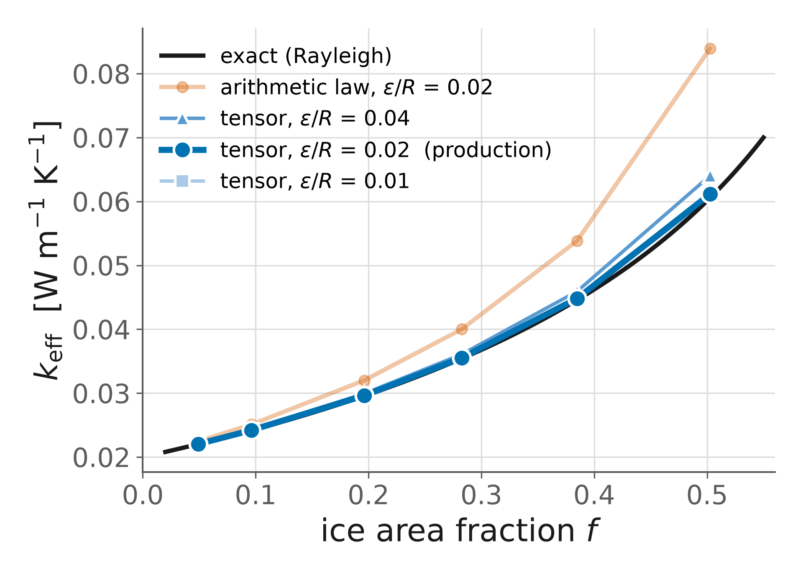 | 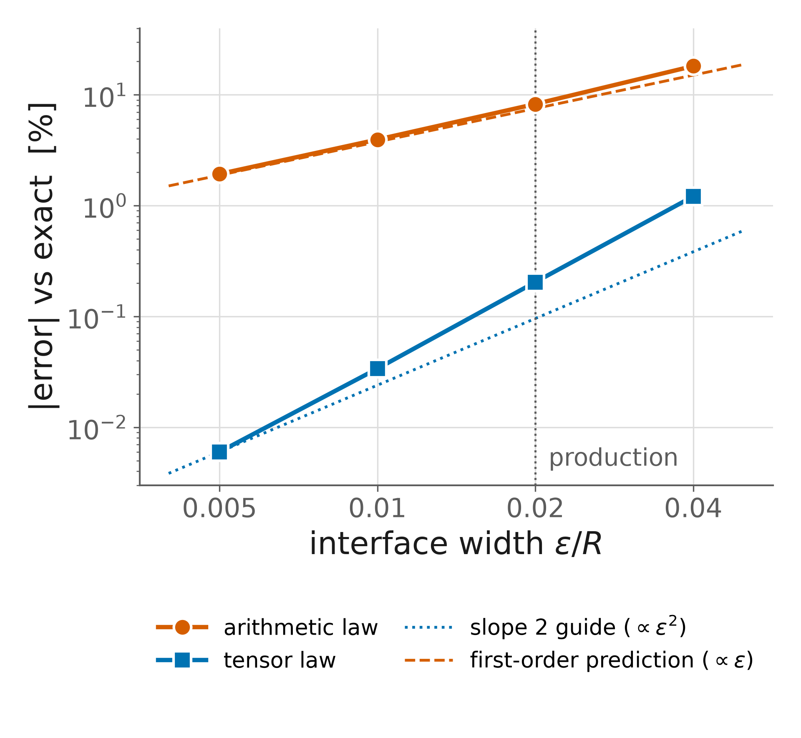 |

Alternative panel (b), the tensor counterpart of slide 3b:
`figures/fig6c_error_vs_f_tensor.png`.

**On-slide text**

- With the tensor law, every width falls onto the exact curve at every ice fraction (a).
- At production resolution the error is **at most +1.0%** anywhere in the sweep, against up to +39% for the arithmetic law:

  | f | 0.05 | 0.20 | 0.39 | 0.50 |
  |---|---|---|---|---|
  | arithmetic, ε/R = 0.02 | +1.9% | +8.3% | +20.8% | +38.6% |
  | **tensor, ε/R = 0.02** | **+0.05%** | **+0.20%** | **+0.51%** | **+0.98%** |

- The arithmetic error falls in proportion to ε, matching the theory's slope to 1.9% with nothing fitted.
  The tensor error falls about as ε^2.5 (b): **no first-order term is left.**
- Flat ice slab: the tensor law is exact to **4 × 10⁻⁷** at every width, where
  the arithmetic law is 3.8–59% high.

**Talking points**

1. At our production resolution the error at f = 0.2 drops from 8.3% to
   0.2%, a factor of about 40. Getting 0.2% with the old law would take an
   interface about 40 times thinner, which means roughly 1600 times more
   elements in 2-D.
2. The improvement holds everywhere in the sweep. The tensor error is about
   0.9%, 2.5% and 6% of the arithmetic error at ε/R = 0.01, 0.02 and 0.04, and
   those ratios barely change with f. That is second-order convergence, and
   crowding does not break it.
3. Panel (b) shows the whole argument in one picture. The orange data sit on
   the dashed first-order prediction, so the theory explains the old error
   quantitatively. The blue data have a steeper slope, so the first-order
   error is gone.
4. The disk tests the full tensor, including its off-diagonal terms, because
   the normal points in every direction. The slab tests only the across
   direction, and there it is exact to solver precision. In the sweep,
   k_00 = k_11 to within 3 × 10⁻⁹, so the cell solver contributes nothing to
   these errors.
5. The remaining O(ε²) error comes from curvature and from the diffuse disk
   holding slightly more ice (π²ε²/3R² relative). We did not derive its
   coefficient; the ~2.5 order is observed. Nicoli et al. (2011) also saw
   near-quadratic convergence on their disk.

---

## Slide 7: What it changes on the real packing

**Figures (side by side):**

| (a) k_eff over 30 days, both laws | (b) Rise since day 1 |
|---|---|
| 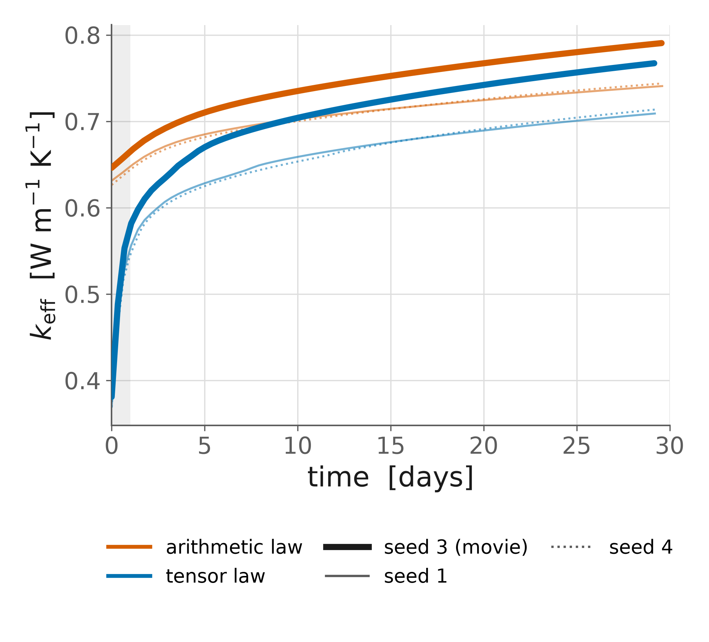 | 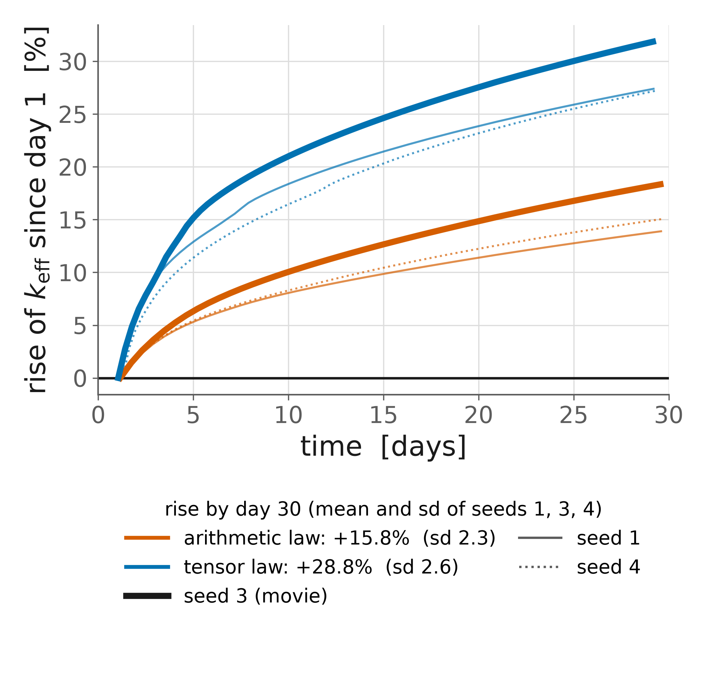 |

**On-slide text**

- These are the stored pilot snapshots (three seeds, 30 days at −20 °C),
  re-evaluated with the tensor law in PetIGA. **Nothing was re-simulated.** The
  microstructure is identical; only the k_eff solve changed.
- At t = 0 the grains just touch. There the arithmetic law reads **k = 0.63
  against 0.37: +71% too high**, because the band welds the contacts.
- **Rise from day 1 to day 30: +15.8% (arithmetic) → +28.8% (tensor)**,
  sd 2.3 and 2.6 points. The sintering signal is **1.8× larger** than we
  measured.

| seed | arithmetic | tensor |
|---|---|---|
| 1 | +13.9% | +27.4% |
| 3 | +18.3% | +31.9% |
| 4 | +15.0% | +27.2% |
| mean (sd) | **+15.8% (2.3)** | **+28.8% (2.6)** |

**Talking points**

1. This is the result the whole detour was for. The campaign reports the rise
   of k_eff during sintering. The old law understated it by almost half,
   because its bias was largest exactly where sintering starts, at point
   contacts, and shrank as the necks grew. That is slides 1 and 3 on the real
   geometry.
2. Panel (a): the curves cross around day 10. Early on, the arithmetic law is
   too high because the band stands in for necks that do not exist yet. Later
   the necks are real, and the two laws come closer together.
3. The baseline is day 1, not t = 0. The first hours are the initial condition
   relaxing onto its equilibrium profile, not sintering.
4. Seed 2 is left out. Its first-half replay job was lost to a cluster node
   failure, so it has no day-1 value under the tensor law. It is a missing
   run, not an outlier.
5. Cost: the tensor law needs about 1.4× the linear-solver iterations of the
   old law on the packing. It is a routine post-processing cost.
6. **Limits:**
   - This is steady state only. It is a statement about the k_eff solve, not
     about the phase-field evolution equations.
   - The residual is O(ε²).
   - Where two interfaces come within a few ε of each other, as in young
     sinter necks, the thin-band analysis no longer holds for any
     interpolation. The day-0 number is the least certain one, and it is also
     excluded by the day-1 baseline.
   - It does not correct errors in φ itself.

*Sources:* `studies/keff_sintering/coefficient_fix/compare_laws.csv` and
`CAMPAIGN.md` (stage 1). The figures are rebuilt from the replay CSVs in
`HPC_results/.../batch_2026-09-24__12.18.18_keff_replay` (tensor) and
`batch_2026-09-16__13.16.11_pilot_keff` (arithmetic), with the same leg
merging and baseline rule as `compare_laws.py`.

---

## Slide 7b (backup): Two independent fixes agree on the packing

**Figures (side by side):**

| (a) Pilot seed 1, day 1 | (b) Pilot seed 1, day 30 |
|---|---|
| 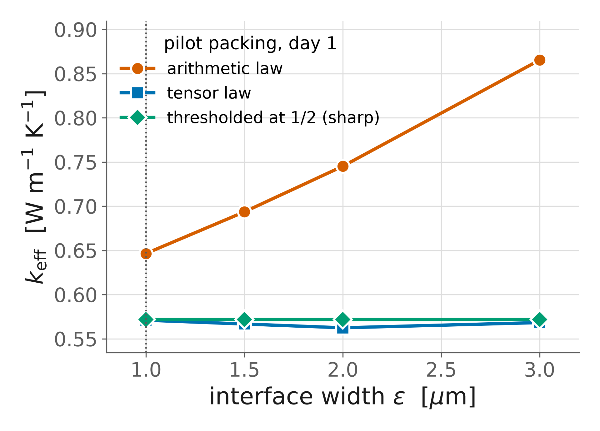 | 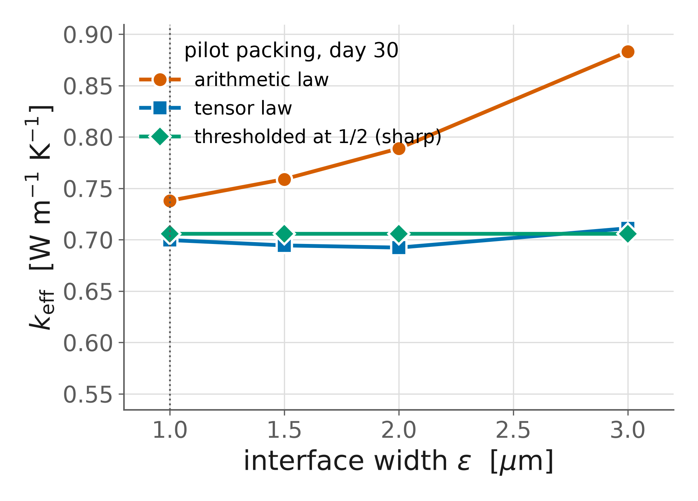 |

**On-slide text**

- Re-widening the interface on one snapshot moves the arithmetic k_eff a
  lot: +34% on day 1 and +20% on day 30 when ε is tripled. It moves the
  tensor k_eff by −0.5% and +1.6%.
- The tensor law agrees within 1% with a completely independent fix, which
  thresholds φ at ½ and uses the sharp conductivities.

**Talking points**

1. This is a quick python check on the coarser output grid, and it uses only
   the diagonal of the tensor. The PetIGA replay on slide 7 is the real
   measurement. This slide is here in case someone asks, "How do you know the
   tensor law isn't just wrong in a different way?"
2. Its day-1 → day-30 rise, +22.5% (tensor) against +14.1% (arithmetic),
   points the same way as the PetIGA ensemble.

---

## References

Every DOI below was checked against Crossref on 2026-09-24. The papers the
slides lean on were read from the PDFs in
`effective_thermal_cond/lamena_conductivity_papers/`.

| Reference | Used for | Check |
|---|---|---|
| Calonne, N., Flin, F., Morin, S., Lesaffre, B., Rolland du Roscoat, S., & Geindreau, C. (2011). Numerical and experimental investigations of the effective thermal conductivity of snow. *Geophys. Res. Lett.* 38, L23501. doi:10.1029/2011GL049234 | cell problem (slide 2) | DOI verified in the earlier writeup |
| Rayleigh, Lord (1892). On the influence of obstacles arranged in rectangular order upon the properties of a medium. *Phil. Mag.* 34, 481–502. doi:10.1080/14786449208620364 | exact disk-array solution | DOI verified in the earlier writeup |
| Perrins, W. T., McKenzie, D. R., & McPhedran, R. C. (1979). Transport properties of regular arrays of cylinders. *Proc. R. Soc. Lond. A* 369, 207–225. doi:10.1098/rspa.1979.0160 | coefficients of the exact formula | DOI verified in the earlier writeup |
| **Nicoli, M., Plapp, M., & Henry, H. (2011). Tensorial mobilities for accurate solution of transport problems in models with diffuse interfaces. *Phys. Rev. E* 84, 046707. doi:10.1103/PhysRevE.84.046707** | **the tensor law, the two interface terms, the disk test (slides 4b, 5)** | **read in full**: eqs. 7, 9, 15, 16, 17 and figs. 1–2 match what the slides attribute to it |
| Ettrich, J., Choudhury, A., Tschukin, O., Schoof, E., August, A., & Nestler, B. (2014). Modelling of transient heat conduction with diffuse interface methods. *Modelling Simul. Mater. Sci. Eng.* 22, 085006. doi:10.1088/0965-0393/22/8/085006 | series/parallel motivation; extension to transient heat conduction | read §1 and §5: the series/parallel argument and the tensor matrix (their eq. 1) are there; their new content is heat capacity |
| Milton, G. W. (2002). *The Theory of Composites.* Cambridge University Press. doi:10.1017/CBO9780511613357 | laminate formulas: harmonic across, arithmetic along | read ch. 9 §9.2 (pp. 159–162), Tartar's formula eq. 9.7 |
| Karma, A., & Rappel, W.-J. (1998). Quantitative phase-field modeling of dendritic growth in two and three dimensions. *Phys. Rev. E* 57, 4323–4349. doi:10.1103/PhysRevE.57.4323 | thin-interface expansion (4b) | DOI verified in the earlier writeup; also cited by Nicoli et al. for this purpose |
| Almgren, R. F. (1999). Second-order phase field asymptotics for unequal conductivities. *SIAM J. Appl. Math.* 59, 2086–2107. doi:10.1137/S0036139997330027 | unequal conductivities (4b) | DOI verified in the earlier writeup; also cited by Nicoli et al. |
| McFadden, G. B., Wheeler, A. A., & Anderson, D. M. (2000). Thin interface asymptotics for an energy/entropy approach to phase-field models with unequal conductivities. *Physica D* 144, 154–168. doi:10.1016/S0167-2789(00)00064-6 | unequal conductivities (4b) | DOI verified in the earlier writeup |

**Read, related, and deliberately not cited** (they are about elasticity, not
conduction, and Nicoli and Ettrich are direct matches):
- Schneider et al. (2015, *Comput. Mech.* 55, 887–901, doi:10.1007/s00466-015-1141-6)
  build the interface interpolation from the mechanical jump conditions:
  continuous traction, and a displacement gradient that jumps only in the
  normal direction.
- Durga, Wollants & Moelans (2013, *MSMSE* 21, 055018, doi:10.1088/0965-0393/21/5/055018)
  show that interpolation creates interfacial excess stresses and strains.
- Mosler, Shchyglo & Montazer Hojjat (2014, *JMPS* 68, 251–266,
  doi:10.1016/j.jmps.2014.04.002) use a rank-one (laminate) homogenization
  inside the interface, bounded by the Voigt and Reuss models.

They are good answers if someone asks whether this idea exists outside heat
conduction. **Also not cited:** Hashin and Benveniste (thin interphases), and
Yang et al. (2022, *Scripta Mater.* 212, 114537), because they model physical
interface resistances, which are meant to be kept.

## Caveats to keep in mind

The tensor law is established (Nicoli et al. 2011). What is specific to us is the application: the
snow k_eff cell problem on an evolving phase field, the size and geometry
dependence of the old law's bias, and the verification. Before relying on the
sweep, check `collect_sweep.py`: it reported "all checks passed". The
packing-level panels on slides 1b and 7b come from a coarser python solver and
are indicative. Slide 7 is the PetIGA replay (3 seeds; seed 2 lost to a node
failure).
