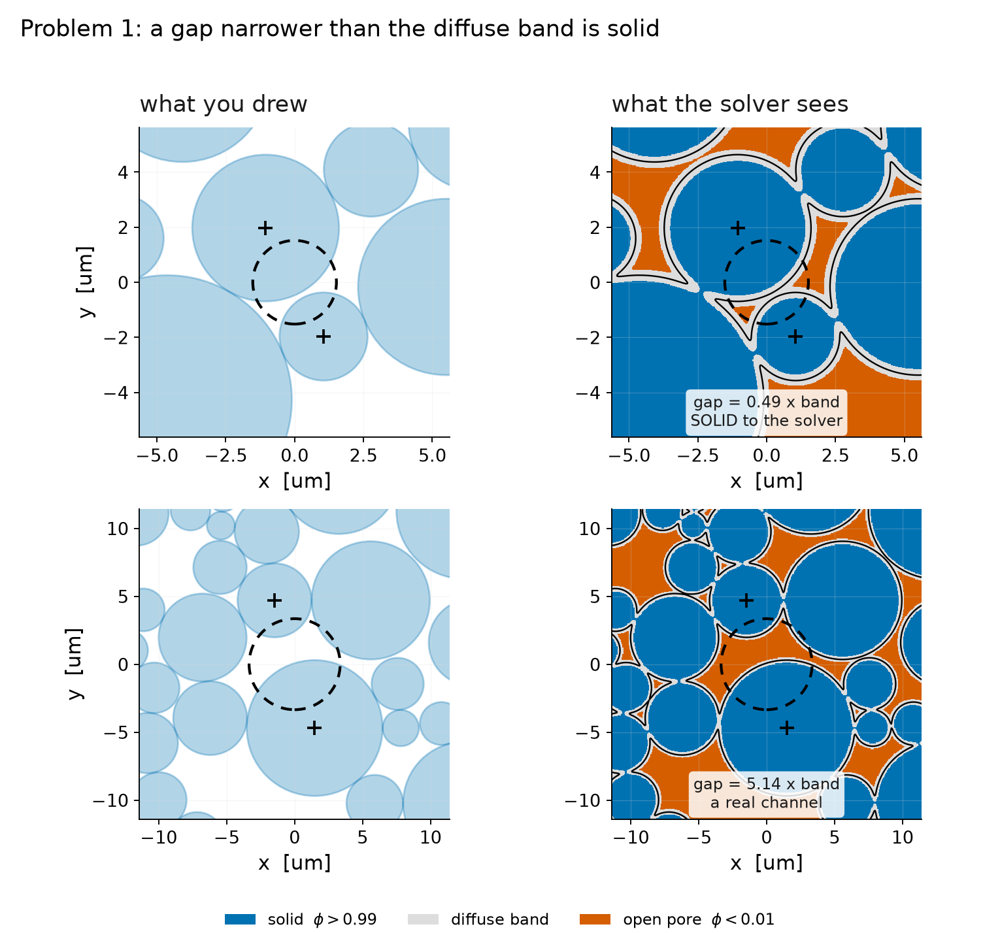
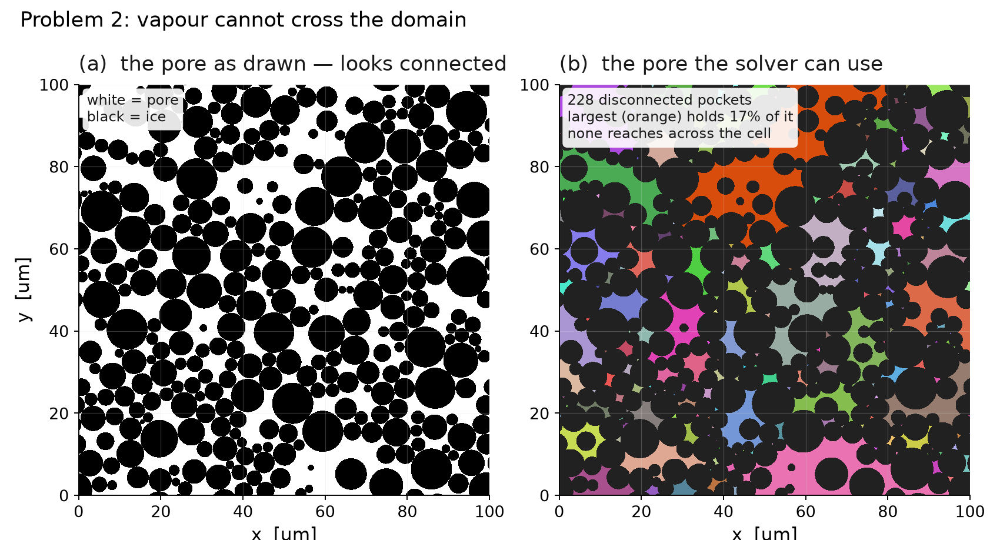
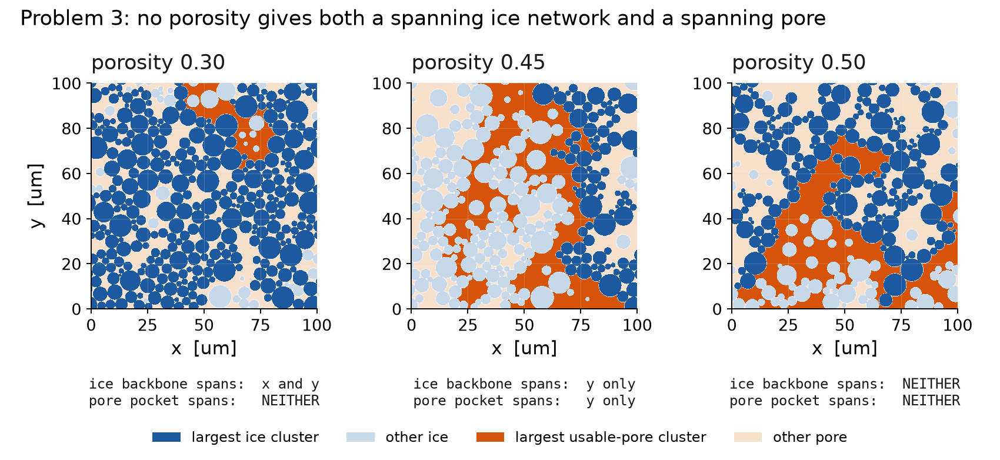
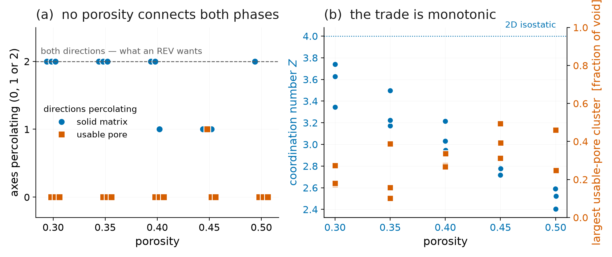

# Packing design for the sintering → k_eff study

Measurements behind the 2D packing design. Everything here is geometric — no
solver, ~2 s per packing, whole sweep in a couple of minutes.

```bash
venv_enceladus/bin/python studies/packing_design/measure_connectivity.py
venv_enceladus/bin/python studies/packing_design/plot_connectivity.py
venv_enceladus/bin/python studies/packing_design/render_problems.py
```

Outputs `connectivity.csv`, `connectivity.png` and the three `problem*.png`
figures next to this file.

---

## 0. The three problems, in pictures

**Problem 1 — a gap narrower than the diffuse band is solid.** `phi` is built
the way the solver builds it: the additive Molaro convention, so two grains
each contributing ~0.5 at a near-tangency SUM to ~1 and the gap fills in. At
the midpoint of a gap `g` the sum is `1 - tanh(g/4eps)`, so `phi` only drops
below 0.01 once **`g > 10.6 eps`**. Below that there is no pore there at all,
whatever the drawing says.



**Problem 2 — vapour cannot cross the domain.** The pore looks connected and is
not. Eroding by `band/2` leaves 228 disconnected pockets, the largest holding
17% of the void, none spanning the cell. This is at `t = 0`, before any
sintering.



**Problem 3 — opening the pore breaks the ice.** Only the largest cluster of
each phase is coloured, so "spans the cell" is visible rather than asserted.
Raising porosity grows the orange pore pocket and simultaneously shatters the
blue ice backbone: at 0.30 the ice spans both axes and the pore spans none; by
0.45 each spans only `y`; by 0.50 neither spans anything.



---

## 1. The metrics were measuring the wrong things

Three corrections, all now in `preprocess/packing_lib.py`. Each changed the
answer, not just the number.

**Coordination was counted at 1/44 of the relevant scale.** A contact was a gap
within `0.02·r_min` = 9.5 nm. The diffuse band is `9.2·eps` = 414 nm, and the
solver joins with solid *every* pair closer than the band. The reference packing
reads **Z = 2.03 by the old measure and 3.26 by the new one** — "barely rigid,
half of isostatic" versus "nearly isostatic". Only the second describes the
simulation. `metadata.json` now carries `coordination_at_band` beside
`coordination_number`.

**Pore connectivity used 4-connectivity on both phases.** Two phases on a square
lattice cannot both do that — at a near-tangency, which is most throats here, it
severs both. Worse, the 4-connected cluster count was not a property of the
packing at all; it grew with raster resolution:

| raster | 1024 | 2048 | 4096 |
|---|---|---|---|
| sharp pore, 4-conn | 710 | 881 | 1229 |
| sharp pore, 8-conn | 291 | 317 | 537 |
| **usable pore, 8-conn** | **228** | **228** | **234** |

**The sharp pore is not the usable pore.** `phi` never reaches 0 inside the
band, so a channel narrower than it blocks vapour and conducts like solid
however open it looks geometrically. `open_pore()` erodes by `band/2`. That is
the row that *converges* above — largest-cluster fraction 0.171 / 0.172 / 0.172
across the same three rasters. It is the real number, and it says the usable
pore was already in **228 pieces at t = 0, the largest holding 17% of the
void** — before any sintering.

Pass `--band-per-mean-r` to the generator to record these. Without a band there
is no way to grade pore connectivity at all, which is why the earlier packings
looked acceptable.

---

## 2. No porosity connects both phases



Porosity 0.30–0.50, three seeds each, `--periodic xy`:

**0 of 15 packings percolate in both directions in both phases.**

The usable pore never percolates in both directions at any porosity. Pushing
porosity up to buy pore connectivity instead costs solid connectivity — by
φ = 0.45 the solid fails in x, and by φ = 0.50 some seeds fail in both. The
trade is monotonic (panel b): `Z` falls from 3.7 to 2.4 as the largest
usable-pore cluster rises from 0.17 to 0.46, and neither reaches what an REV
wants.

This is Kesten's theorem showing up in a real packing: away from criticality, at
most one phase percolates on a plane. **It is physics of two dimensions, not a
defect in the packing generator, and no amount of throat surgery or porosity
tuning buys a second percolating phase.** Criticality itself is not an escape —
that is where the correlation length diverges and no REV exists.

Note the anisotropy: solid fails in **x** first, never y. Gravity deposition
builds vertical load paths. That is a real structural anisotropy and it is why
`k_xx` vs `k_yy` needs to be a reported quantity, not an assumed-isotropic
average.

---

## 3. Throat surgery was tried and does not work

The idea was to push every gap to one side or the other of the band — a true
contact or a channel `phi` can open — so `k_eff` is not inflated by solid
bridges across channels meant to be open. Two versions failed, for two
different reasons, and both are worth recording so they are not re-attempted.

**Blind threshold.** Split on gap alone, close below `0.6·band`. Made the honest
pore connectivity *worse* (largest usable cluster 0.21 → 0.16): with this
throat distribution almost everything falls on the close side, 492 closed
against 9 opened.

**Percolation-targeted.** Open the widest closed throats, cheapest first, until
the pore network wraps the torus. The periodic union-find was correct (unit
tested), but it reported the target already met while the raster said otherwise
— because grain-adjacency percolation is not pore percolation. The pore network's
*nodes* are the Delaunay triangle interiors, which can be blocked even when the
edges between them are wide. And per §2 the target is unreachable anyway.

**The mover does not converge regardless.** Driving throats to assigned gaps
left *more* ambiguous throats than it started with (230 → 298). The assignment
is geometrically frustrated even though the contact count is under-determined
(492 contacts against 624 degrees of freedom).

**The ambiguous fraction does not vanish with finer `eps` either.** It saturates:

| band/R_ave | 0.332 | 0.166 | 0.083 | 0.042 | 0.017 | 0.008 | 0.004 |
|---|---|---|---|---|---|---|---|
| ambiguous throats | 36% | 31% | 28% | 21% | 15% | 12% | **11%** |

Deposition leaves a scale-free tail of near-tangencies, so ~11% of throats sit
in the forbidden middle however fine the interface gets. Shrinking `eps` by 4×
also does not restore pore percolation (open-pore fraction rises 0.78 → 0.94,
percolation stays (0,0)) — the fragmentation is in the geometry, not the band.

---

## 4. What follows for the study

- **Stop treating pore connectivity as a binary to be designed for.** It is
  always "no". The physical quantity is how *well* the pore communicates, which
  is continuous: an effective vapour diffusivity from the same cell problem
  `k_eff` already solves, with `D_v·phi_a` in place of `K(phi)`. That measures
  partitioning on a graded scale and is nearly free to compute.
- **`k_eff` anisotropy is a first-class result**, not a nuisance — the solid
  percolates anisotropically by construction.
- **Report `coordination_at_band`**, never `coordination_number` alone.
- The 2D pore-communication deficit is a **stated limitation of the 2D model**,
  quantified by the diffusivity above, rather than something the packing design
  can remove.
