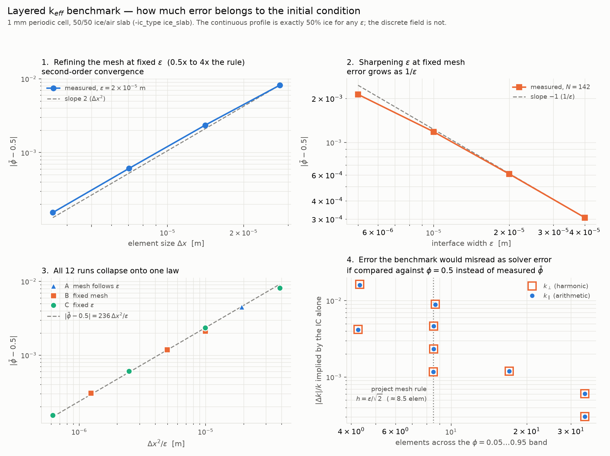

# k_eff verification — initial-condition resolution study

**Status: ✅ CURRENT** (2026-07-31)

Groundwork for the analytic gate on the in-line effective-thermal-conductivity
solver (`-keff`). This directory characterises the *layered benchmark's initial
condition* so that, when the cell-problem solver is switched on, we can tell
solver error apart from discretisation error.

**No k_eff values here yet** — the cell problem is not implemented at this point
(Step 4 of the merge). Everything below is about the phase field the benchmark
feeds to it.

---

## Why this study exists

A 50/50 ice/air layered medium has closed-form effective conductivity, which is
what makes it the benchmark:

| | formula | value at `k_ice = 2.29`, `k_air = 0.02` W/m/K |
|---|---|---|
| `k_∥` parallel to the layers | arithmetic mean, `φ·k_i + (1−φ)·k_a` | **1.155000** |
| `k_⊥` perpendicular | harmonic mean, `1/(φ/k_i + (1−φ)/k_a)` | **0.0396538** |
| `k_01`, `k_10` | — | 0 |

Those are properties of the **continuous** profile. The solver sees a spline fit
to nodal values, whose mean ice fraction is near but not exactly 0.5. Comparing
computed k_eff against the values above would charge the initial condition's
quadrature error to the solver. This study measures that error so the benchmark
can be stated correctly.

## Method

`-ic_type ice_slab` on a 1 mm periodic cell: ice on `[0, Ly/2]`, air above.
One time step, 12 configurations, three sweeps:

All three sweeps are anchored on the **project mesh rule** `h = ε/√2`
(`comp_eps.py`), i.e. `Nx = ⌈√2·Lx/eps⌉`, which puts **~8.5 elements across the
φ=0.05–0.95 band**. Every sweep passes through that production point rather than
sitting to one side of it.

| sweep | what varies | what it isolates |
|---|---|---|
| **A** `mesh follows eps` | `eps` with `Nx` from the rule | every point AT production resolution |
| **B** `fixed mesh` | `eps` at `Nx = 142` (the rule's own answer for `eps=1e-5`) | the effect of `eps` alone |
| **C** `fixed eps` | `Nx` from 0.5× to 4× the rule, at `eps = 2e-5` | the effect of the mesh alone |

> **Band convention.** Element counts here are across the **φ=0.05–0.95** band
> (`6·eps`), matching `comp_eps.py` and the project's ~7.5–10 target. The
> **φ=0.01–0.99** band (`9.2·eps`) gives a count **1.53× larger for the same
> mesh** — 13.0 where this reads 8.5. Mixing the two makes a production mesh look
> heavily over-resolved. (`CLAUDE.md` currently attributes the 7.5–10 figure to
> the 1–99% band; that label appears to be wrong.)

Reproduce with:

```bash
./studies/snow_thermal/verification/run_ic_resolution_study.sh
venv_enceladus/bin/python3 studies/snow_thermal/verification/plot_ic_resolution.py
```

Outputs: `ic_resolution_study.csv`, `ic_resolution_{light,dark}.png`, raw solver
logs under `raw/`.



---

## Results

### 1. The volume-fraction error obeys a single law

All 12 runs collapse onto

```
|φ̄ − 0.5|  ≈  236 · Δx² / eps
```

which each sweep confirms from a different direction: second order in `Δx` at
fixed `eps` (sweep C), inverse-linear in `eps` at fixed mesh (sweep B), and — the
consequence that matters — **only first order in `eps` when the mesh follows the
project rule** (sweep A), since `Δx = ε/√2` there makes `Δx²/eps = eps/2`.

So halving `eps` while holding elements-per-interface constant buys a factor of
2 in ice-fraction accuracy, not the factor of 4 that "second-order" suggests.

### 2. On the production mesh rule the error is simply proportional to eps

Substituting `Δx = ε/√2` into the collapse gives `|φ̄ − 0.5| ≈ 118·eps`, and
sweep A measures the coefficient at 113–120 across a factor of 8 in `eps`:

| `eps` [m] | `Nx` (rule) | elem/band | `|φ̄ − 0.5|` | ÷ eps | implied `|Δk|/k` |
|---|---|---|---|---|---|
| 4.0e-5 | 36 | 8.6 | 4.52e-3 | 113.0 | 8.9e-3 |
| 2.0e-5 | 71 | 8.5 | 2.35e-3 | 117.6 | 4.6e-3 |
| 1.0e-5 | 142 | 8.5 | 1.18e-3 | 118.3 | 2.3e-3 |
| 5.0e-6 | 283 | 8.5 | 5.98e-4 | 119.5 | 1.2e-3 |

**This corrects an earlier statement in this file.** A previous revision said the
initial condition contributes "~0.5% error at the resolution the study runs
use". That figure was measured at the *benchmark's* `eps = 2e-5`, which is 10–40×
larger than the `eps` the packing runs use. Because the error scales linearly
with `eps` on the production rule, the correct figures for the real study
geometries at T = −20 °C are much smaller:

| study configuration | `eps` | `|φ̄ − 0.5|` | k_eff bias |
|---|---|---|---|
| safety 0.5 | 1.0e-6 | ~1.2e-4 | **0.024 %** |
| safety 1.0 | 2.0e-6 | ~2.4e-4 | **0.047 %** |

So the discretisation floor on the safety 0.5 vs 1.0 comparison is **0.024 %**,
not the ~0.2 % quoted earlier. Any difference between the two resolutions above
roughly 0.05 % is real physics — throat closure — rather than numerics. That
makes the shakedown comparison a much sharper instrument than it first appeared.

The benchmark itself must still be evaluated at the measured `φ̄` rather than at
0.5, because at the benchmark's own (deliberately large) `eps` the IC error is
~0.5 %, far above any solver tolerance.

Both components are affected almost identically, because at `φ = 0.5`

```
d ln k/d φ  =  2(k_i − k_a)/(k_i + k_a)  =  1.9654
```

for the arithmetic *and* the harmonic mean, for any contrast ratio. Second-order
terms separate them by at most 1.6% (coarsest mesh) and 0.01% (finest).

### 3. The periodic seam is real and resolved

Independent confirmation that the slab has **two** interfaces — the obvious one
at `y = Ly/2` and one at the `y = 0 ≡ Ly` seam. The interface integral
`∫φ²(1−φ)²dV` has the closed form `2·Lx·eps/6` for two interfaces (half that for
one):

| `eps` [m] | measured | analytic (2 interfaces) | one interface would be |
|---|---|---|---|
| 4.0e-5 | 1.315e-8 | 1.333e-8 | 6.67e-9 |
| 2.0e-5 | 6.468e-9 | 6.667e-9 | 3.33e-9 |
| 1.0e-5 | 3.152e-9 | 3.333e-9 | 1.67e-9 |

Measured values sit 1–7% below analytic (converging as the mesh refines) and
nowhere near the one-interface value. A single-tanh profile would have left the
seam as an unresolved discontinuity and corrupted `k_⊥` specifically.

### 4. Cross-mesh φ projection is exact

Every run also verified, via `-keff_debug_phibar`, that the phase field handed
from the solver mesh to the cloned corrector mesh agrees on mean, centroid and
per-axis mean square to **0.000e+00** relative — serial and on 4 ranks.

---

---

## The analytic gate on the cell-problem solver

Run after the k_eff cell problem landed (Step 4 of the merge). Direct LU
throughout, so the linear solver is not a variable.

```bash
./studies/snow_thermal/verification/run_keff_benchmark.sh
venv_enceladus/bin/python3 studies/snow_thermal/verification/check_keff_benchmark.py
```

**The comparison is against the exact closed form for the *diffuse* profile, not
against the sharp-interface values.** For a layered medium,
`k_∥ = ⟨k⟩` and `k_⊥ = 1/⟨1/k⟩`, and those hold for any `k(y)` — so
`check_keff_benchmark.py` integrates the same tanh profile the IC lays down and
compares. That leaves no modelling error in the comparison; anything left is the
solver or the spline. Comparing against 1.155000 / 0.0396538 would instead be
asking the diffuse profile to reproduce a sharp interface, which it is not
supposed to do at finite `eps`.

| gate | result |
|---|---|
| **1.** `k_∥` vs arithmetic mean at measured `φ̄` | ≤ **8.8e-7** relative, all 7 runs |
| **2.** off-diagonals vanish | max `|k_01|,|k_10|` = **1.5e-16** |
| **3a.** `k_⊥` error falls monotonically with mesh | 5.35e-3 → 5.04e-3 → 3.10e-3 → **1.70e-3** (N = 64→512) |
| **3b.** `k_⊥` at the finest mesh per `eps` | **≤ 3.1e-3** |

`k_⊥` is judged by convergence rather than a fixed tolerance because it is a
harmonic mean across a 114:1 contrast: it is dominated by the low-`k` region,
where the spline's pointwise error is amplified by `1/k²`. `k_∥`, being linear
in `φ`, has no such amplification — hence the six-order-of-magnitude difference
between gate 1 and gate 3.

### The sharp-interface limit is a long way off at benchmark resolution

`k_⊥` for the diffuse profile exceeds the sharp-interface harmonic mean because
the band is a high-conductivity short circuit across a series resistance:

| `eps` | band / layer thickness | `k_⊥` diffuse | `k_⊥` sharp | ratio |
|---|---|---|---|---|
| 3.125e-5 | 0.575 | 9.390e-2 | 3.965e-2 | **2.37** |
| 2.000e-5 | 0.368 | 6.321e-2 | 3.965e-2 | 1.59 |
| 1.563e-5 | 0.287 | 5.594e-2 | 3.965e-2 | 1.41 |
| 7.813e-6 | 0.144 | 4.641e-2 | 3.965e-2 | 1.17 |

This is a model property, not an error — but it is the single most important
number for interpreting the packing runs. **When the diffuse band is a
significant fraction of the feature it is resolving, the perpendicular
(series) component of k_eff reads high, badly.** In a granular packing the
analogous feature is the pore throat, not a 500 µm layer.

---

## CG + GAMG vs direct LU — settling the "iterative solvers are unreliable" claim

```bash
./studies/snow_thermal/verification/run_solver_comparison.sh
```

Meshes are multiples of the **project rule** `h = ε/√2` (`comp_eps.py`), which at
`eps = 2e-5` on a 1 mm cell is `Nx = 71` and gives **8.5 elements across the
φ=0.05–0.95 band**. Element counts below use that 5–95% convention — the same
mesh is 13.0 across the 1–99% band, and mixing the two makes a
production-resolution mesh look heavily over-resolved.

| `Nx` | ×rule | elem/band | dof | LU [s] | GAMG [s] | GAMG its | speedup |
|---|---|---|---|---|---|---|---|
| 71 | 1 | 8.5 | 5 041 | 0.12 | 0.05 | 30 | 2.4× |
| 142 | 2 | 17.0 | 20 164 | 0.86 | 0.18 | 35 | 4.8× |
| 284 | 4 | 34.1 | 80 656 | 6.18 | 0.76 | 37 | 8.1× |
| 568 | 8 | 68.2 | 322 624 | 50.86 | 3.04 | 40 | **16.7×** |
| 1136 | 16 | 136.3 | 1 290 496 | — | 12.92 | 47 | — |
| 2272 | 32 | 272.6 | 5 161 984 | — | 53.36 | 50 | — |

**The two solvers agree to all ten printed digits of `k_00` and `k_11` at every
shared mesh.** Iteration counts grow 30 → 50 while the problem grows 1000×,
i.e. essentially mesh-independent, which is what AMG is supposed to do. Measured
scaling is `O(N^1.03)` for GAMG against `O(N^1.45)` for LU — the latter matching
2-D nested dissection.

### The claim was a plumbing bug, not numerics

`effective_thermal_cond/README.md` asserted that iterative solvers give polluted
answers for this problem class, while its own `solver.h` documented CG+GAMG and
its code shipped `PREONLY`+`LU`. The actual failure is mechanical:

`IGACreateMat` composes an `"IGA"` object onto the matrix and overrides
`MATOP_CREATE_VECS` and `MATOP_DUPLICATE` with IGA-aware versions
(`petigamat.c:385-391`) that hard-error with *"Matrix not generated from IGA"*
when that composed object is missing. AMG builds coarse operators from the fine
matrix; those inherit the overridden operations **without** the composed IGA, so
`PCGAMG` dies during setup — on any mesh, every time, regardless of the physics.

The fix is three lines in `KeffCreate`: clear `MATOP_CREATE_VECS` (which falls
back to a layout-based default) and restore the stock `MATOP_DUPLICATE` from the
`"__IGA_MatDuplicate"` function PetIGA stashes for exactly this purpose. Nothing
in the k_eff path needs the IGA-aware versions.

Also worth recording: plain CG with Jacobi converges to the *same* answer
(`k_11 = 6.284918655e-02`, identical to LU and GAMG) in 256 iterations. So no
iterative method was ever giving a wrong answer here — GAMG simply could not
start.

### Why this matters for the study meshes

At `Nx = Ny = 2829` (the T = −20 °C study geometries) the corrector is ~8.0 M
unknowns. Extrapolating the measured scalings: GAMG ≈ 80 s per sample serial and
far less in parallel, against ≈ 90 min per sample for LU. In-line k_eff at any
useful cadence is only possible because the iterative path works.

---

## t=0 probe — an UPPER BOUND on the eps artifact


```bash
NPROCS=6 ./studies/snow_thermal/verification/run_t0_probe.sh both
```

Compares k_eff at **t = 0** between safety 0.5 and safety 1.0 on the three
shakedown packings. At t=0 the two resolutions describe the *identical* sharp
microstructure, because `-ic_grain_union 1` puts the φ=0.5 contour on the sharp
union surface for any eps. So no sintering, no kinetics, no sharp-interface-limit
error — only the thickness of the diffuse band differs. One cell solve per
configuration, ~6 s and ~30 s respectively on 6 ranks.

| packing | pore φ | throat p50 | k_iso @ safety 0.5 | @ safety 1.0 | gap |
|---|---|---|---|---|---|
| phi0.250_seed1 | 0.248 | 4.00 µm | 0.8951 | 1.1726 | **+31.0 %** |
| phi0.325_seed3 | 0.325 | 5.95 µm | 0.5477 | 0.7581 | **+38.4 %** |
| phi0.400_seed5 | 0.398 | 12.61 µm | 0.3716 | 0.5169 | **+39.1 %** |

**The discretisation floor is 0.024 %. This is three orders of magnitude above
it.** Halving eps changes k_eff on a fixed microstructure by ~35 %.

It is not a volume-fraction effect: `phi_bar` differs by only ~0.4 % between the
two, and in the *opposite* direction — safety 1.0 has slightly **less** ice yet
conducts ~35 % **more**. The extra conductance is purely geometric, from the
band filling pore space.

Why it is so large: the ice skeleton **does not percolate** in these packings
(`solid_percolates_x/y = false`, `solid_largest_cluster_frac ≈ 0.009`). k_eff is
therefore set by the weakest links in a series network, which is exactly what a
widened diffuse band bridges. In a percolation-limited medium k_eff is
extraordinarily sensitive to anything that adds conducting paths.

### A prediction this refutes

Earlier work in this directory proposed that a gap exceeding the floor, *and*
**decreasing with porosity**, would be the throat-closure signature — reasoning
from the band ÷ p50-throat ratio, which falls 4.60 → 3.09 → 1.46 across these
packings. The measured gap does the opposite: it is nearly flat and slightly
**increasing** with porosity (31.0 → 38.4 → 39.1 %).

So the band ÷ median-throat ratio is **not** the controlling variable. Bridging
severity depends on how much of the whole throat-size *distribution* falls
between the two band widths, and those distributions are strongly skewed —
p5 = p25 = 4.00 µm for all three (the design contact gap), while p75 is 16.6 /
32.7 / 45.2 µm. Do not use the p50 ratio as a diagnostic.

### Read this as a worst case, not as the study's error bar

**t = 0 is the configuration in which this artifact is maximal, by
construction**, and an earlier revision of this file overstated the result by not
saying so.

- The packings are jammed with a deliberate **4 µm contact gap**
  (`generate_packing.py`: gap = 0 disconnects the pore space in 2D).
- `solid_largest_cluster_frac ≈ 0.009` — at t = 0 there is essentially **no solid
  connectivity**, so every conduction path runs through those 4 µm gaps.
- The diffuse band is 9.2 µm at safety 0.5 and 18.4 µm at safety 1.0 — **wider
  than the gap in both cases**.

So at t = 0 the band *is* the conduction path, and 35 % sensitivity to doubling
it is close to tautological. A sanity check agrees: k_iso = 0.895 W/m/K at
φ_ice = 0.75 is what one would expect from *well-sintered* firn, but this
structure is not sintered at all. **The t = 0 values are artifact-dominated and
should not be quoted as conductivities.**

Once DSM builds real necks the conduction path is solid ice rather than
band-bridged vapour gaps, and the sensitivity should fall — possibly a long way.
The study's observable is k_eff(t) *after* metamorphism, so the number that
matters is the gap at the end of a run, not at the start.

### What is and is not established

1. **safety 1.0 is not usable at t = 0**, and any k_eff reported near t = 0 at
   either resolution is suspect.
2. **Not established: whether this persists after sintering.** A 35 % gap on an
   unsintered skeleton does not imply a 35 % gap on a necked one.
3. Both questions sit upstream of the REV study, but only if (2) turns out badly.

**Next step — measure the gap versus time, not another t = 0 point.** Run one
packing at both resolutions for a few hundred steps with `-keff_freq` set small,
and plot `k_iso(t; safety 1.0) / k_iso(t; safety 0.5)`:

- ratio decaying toward 1 as necks form → the artifact is a start-up transient,
  safety 0.5 is fine and safety 1.0 may be acceptable at late times;
- ratio holding near 1.35 → structural, and an eps ladder
  (safety 0.5 → 0.25 → 0.125) becomes necessary before any k_eff is trusted.
  That ladder is cheap on the 0.5 mm calibration packing
  (`inputs/packings_calib/`), where safety 0.125 is only Nx ≈ 2829.

---

## Is our initialisation introducing the eps dependence?

Run with:

```bash
./studies/snow_thermal/verification/run_eps_convergence_dsm.sh
venv_enceladus/bin/python3 studies/snow_thermal/verification/plot_eps_convergence_dsm.py \
    --s05 <results>/phi0.325_0.5mm_T-20_s05/<stamp>_snow_T-20_6hr_epsconv \
    --s10 <results>/phi0.325_0.5mm_T-20_s10/<stamp>_snow_T-20_6hr_epsconv
```

0.5 mm calibration packing, 6 h at −20 °C, **identical initial condition**, both
safety factors, `k_eff` recorded at **every accepted step** and field snapshots
every step. The observable is

```
R(t) = k_iso(t; safety 1.0) / k_iso(t; safety 0.5)
```

- **R → 1 as necks form** — the eps dependence is a *start-up transient*.
  safety 1.0 becomes usable, and the initialisation is the thing to fix.
- **R flat near 1.35** — structural; the eps ladder (0.5 → 0.25 → 0.125) is then
  required before any k_eff is trusted.

### Why a transient is the likely outcome

The profile we lay down is `φ = ½(1 − tanh(d/2ε))` on the signed distance to the
union of the grains (`-ic_grain_union 1`). That **is** the exact equilibrium of
the double well — but only for a **flat, isolated** interface. It is not
stationary where the geometry is curved, and emphatically not at the 4 µm
contact gaps, where the tanh tails of two opposing grain surfaces overlap. There
the superposed profile is not a solution of anything, and Allen–Cahn relaxes it
over a timescale set by the mobility and ε.

That relaxation moves the neck geometry by O(ε). Any observable measured while it
is happening therefore carries an ε signature that is **not physics** — which is
exactly what the t=0 probe measured, and why its 31–39 % should be read as an
initialisation artifact rather than a statement about the model.

Relaxation itself is normal and expected: the literature's own position is that
a phase-field code *should* relax a wrong-width profile to the correct one
([Comparison of phase-field models for surface diffusion](https://arxiv.org/pdf/0711.1809)).
The defect is not that relaxation occurs — it is that we start the clock, and
start measuring, in the middle of it.

### More robust initialisations, from the literature

1. **Pre-relaxation (equilibration) run.** Evolve the Allen–Cahn dynamics alone,
   with the phase-change sources off, for a short time; then start the physics
   from the relaxed field with the clock reset. Described as solving Allen–Cahn
   "initially for a few time steps to obtain the desired particle shape and to
   get a smooth interface between phases"
   ([Efficient implementation of the Allen–Cahn phase-field method](https://www.sciencedirect.com/science/article/pii/S0045793025002282)),
   and as a deliberate way to remove a large numerical artifact from the initial
   condition rather than starting from an analytic equilibrium
   ([Mitigation of Initial Transients](https://arxiv.org/html/2607.15072)).
   **This solver already has the dynamics**: `-decouple_phase_change 1` zeroes
   every phase-change coupling and gives pure AC evolution
   (`src/assembly.c:145-150`). What is missing is a restart path — a way to read
   a solution vector back as an initial condition. `preprocess/reinitialize_phasefield.py`
   does part of this already (signed distance via `distance_transform_edt`).
2. **High-mobility Cahn–Hilliard smoothing.** A few iterations of the
   Cahn–Hilliard operator alone, at high mobility, starting from a sharp
   characteristic function, to manufacture a diffuse configuration
   ([Comparison of phase-field models for surface diffusion](https://arxiv.org/pdf/0711.1809)).
3. **Report against the post-relaxation state**, not t=0 — cheap, and it makes
   `k_eff(t)/k_eff(t_relaxed)` comparable across ε even if the absolute values
   are not.

Option 1 is the one that matches this codebase, and it is a small change: a
`-restart_from <sol.dat>` that calls `IGAReadVec` in place of the IC dispatch
would make the two-stage workflow possible without touching the physics.

## Consequences for the rest of the study

1. **State the benchmark at measured `φ̄`.** `inputs/geometry/2D_ice_slab_keff.opts`
   documents this. A tolerance of 1e-6 against the nominal 1.155000 is not
   achievable at any mesh we would run, and is not a meaningful target.
2. **The safety 0.5 vs 1.0 comparison has a floor of 0.024 %, not 0.2 %.**
   See §2 above. Differences above ~0.05 % between the two resolutions are real
   — and the mechanism to suspect is throat closure, since the diffuse band
   (9.2·eps = 9.2 µm at safety 0.5, 18.4 µm at safety 1.0) exceeds the median
   throat (4.0 / 5.95 / 12.6 µm for the three shakedown packings) in most cases.
   Expect the effect to be largest at low porosity, where throats are tightest.
3. **Interface-integral diagnostics run 1–7% low** at these resolutions. Worth
   remembering when `SSA_evo.dat`'s `sub_interf` column is used quantitatively.

## Files

| file | contents |
|---|---|
| `run_ic_resolution_study.sh` | driver; 12 solver runs, writes the CSV |
| `plot_ic_resolution.py` | four-panel figure, light and dark |
| `ic_resolution_study.csv` | the measurements |
| `ic_resolution_{light,dark}.png` | the figure |
| `raw/` | full solver logs, one per configuration |

Plot colours are categorical slots 1–3 of the project's validated palette;
`postprocess/validate_palette.py` checks colour-blind separation (worst pair
ΔE = 10.0 under protanopia, threshold 8.0).
