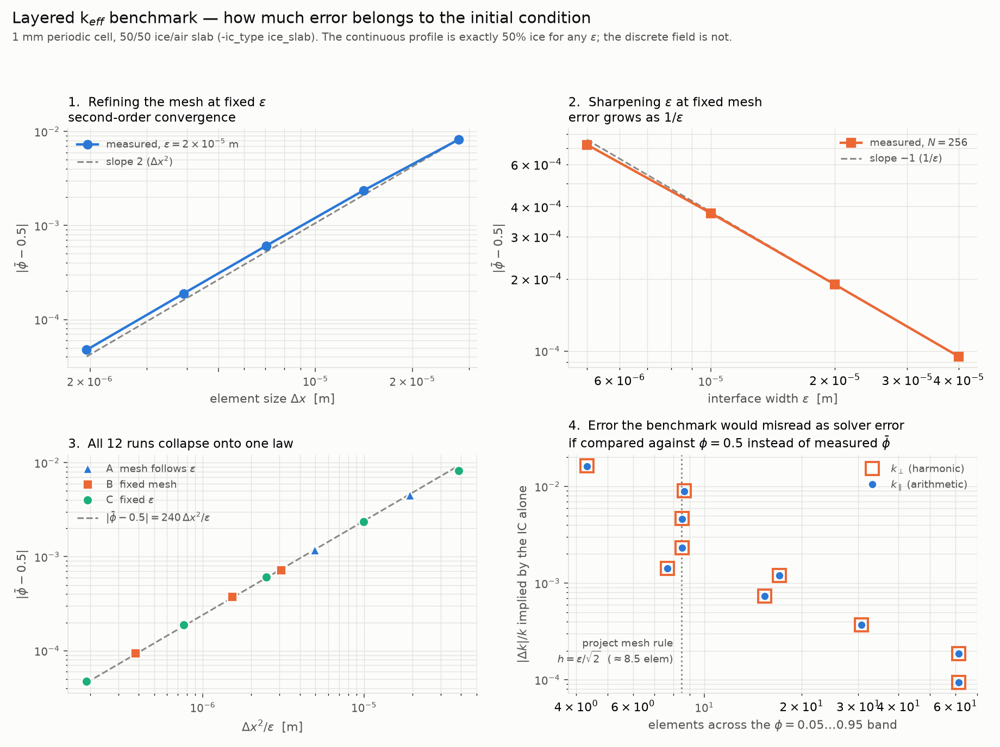

# k_eff verification — initial-condition resolution study

**Status: ✅ CURRENT** (2026-07-31)

Groundwork for the analytic gate on the in-line effective-thermal-conductivity
solver (`-keff`). This directory characterises the *layered benchmark's initial
condition* so that, when the cell-problem solver is switched on, we can tell
solver error apart from discretisation error.

**No k_eff values here yet** — the cell problem is not implemented at this point
(Step 4 of the merge). Everything below is about the phase field the benchmark
feeds to it.

---

## Why this study exists

A 50/50 ice/air layered medium has closed-form effective conductivity, which is
what makes it the benchmark:

| | formula | value at `k_ice = 2.29`, `k_air = 0.02` W/m/K |
|---|---|---|
| `k_∥` parallel to the layers | arithmetic mean, `φ·k_i + (1−φ)·k_a` | **1.155000** |
| `k_⊥` perpendicular | harmonic mean, `1/(φ/k_i + (1−φ)/k_a)` | **0.0396538** |
| `k_01`, `k_10` | — | 0 |

Those are properties of the **continuous** profile. The solver sees a spline fit
to nodal values, whose mean ice fraction is near but not exactly 0.5. Comparing
computed k_eff against the values above would charge the initial condition's
quadrature error to the solver. This study measures that error so the benchmark
can be stated correctly.

## Method

`-ic_type ice_slab` on a 1 mm periodic cell: ice on `[0, Ly/2]`, air above.
One time step, 12 configurations, three sweeps:

| sweep | what varies | what it isolates |
|---|---|---|
| **A** `mesh follows eps` | `eps` and `Nx = ⌈√2·Lx/eps⌉` together | the configuration the real study runs use |
| **B** `fixed mesh` | `eps` at `Nx = 256` | the effect of `eps` alone |
| **C** `fixed eps` | `Nx` at `eps = 2e-5` | the effect of the mesh alone |

Reproduce with:

```bash
./studies/snow_thermal/verification/run_ic_resolution_study.sh
venv_enceladus/bin/python3 studies/snow_thermal/verification/plot_ic_resolution.py
```

Outputs: `ic_resolution_study.csv`, `ic_resolution_{light,dark}.png`, raw solver
logs under `raw/`.



---

## Results

### 1. The volume-fraction error obeys a single law

All 12 runs collapse onto

```
|φ̄ − 0.5|  ≈  240 · Δx² / eps
```

which each sweep confirms from a different direction: second order in `Δx` at
fixed `eps` (sweep C), inverse-linear in `eps` at fixed mesh (sweep B), and — the
consequence that matters — **only first order in `eps` when the mesh follows the
project rule** (sweep A), since `Δx ∝ eps` there makes `Δx²/eps ∝ eps`.

So halving `eps` while holding elements-per-interface constant buys a factor of
2 in ice-fraction accuracy, not the factor of 4 that "second-order" suggests.

| sweep A (project mesh rule) | `eps` [m] | `Nx` | `φ̄` | `|φ̄ − 0.5|` |
|---|---|---|---|---|
| safety 1.0 analogue | 4.0e-5 | 36 | 0.504521 | 4.52e-3 |
| safety 0.5 analogue | 2.0e-5 | 71 | 0.502351 | 2.35e-3 |
| safety 0.25 analogue | 1.0e-5 | 142 | 0.501183 | 1.18e-3 |

### 2. What that costs the benchmark

The implied bias in k_eff if it were compared against `φ = 0.5`:

| elements across the φ=0.01…0.99 band | `|Δk|/k` |
|---|---|
| 6.6 | 1.6e-2 |
| **13.1  ← the project mesh rule** | **4.6e-3** |
| 26.1 | 1.2e-3 |
| 47.1 | 3.7e-4 |
| 94.2 | 9.3e-5 |

**At the resolution the study runs actually use, the initial condition alone
contributes ~0.5% error to both k_eff components.** That is far above any
sensible solver tolerance, which is why the benchmark must be evaluated at the
measured `φ̄`, not at 0.5.

Both components are affected almost identically, because at `φ = 0.5`

```
d ln k/d φ  =  2(k_i − k_a)/(k_i + k_a)  =  1.9654
```

for the arithmetic *and* the harmonic mean, for any contrast ratio. Second-order
terms separate them by at most 1.6% (coarsest mesh) and 0.01% (finest).

### 3. The periodic seam is real and resolved

Independent confirmation that the slab has **two** interfaces — the obvious one
at `y = Ly/2` and one at the `y = 0 ≡ Ly` seam. The interface integral
`∫φ²(1−φ)²dV` has the closed form `2·Lx·eps/6` for two interfaces (half that for
one):

| `eps` [m] | measured | analytic (2 interfaces) | one interface would be |
|---|---|---|---|
| 4.0e-5 | 1.315e-8 | 1.333e-8 | 6.67e-9 |
| 2.0e-5 | 6.468e-9 | 6.667e-9 | 3.33e-9 |
| 1.0e-5 | 3.152e-9 | 3.333e-9 | 1.67e-9 |

Measured values sit 1–7% below analytic (converging as the mesh refines) and
nowhere near the one-interface value. A single-tanh profile would have left the
seam as an unresolved discontinuity and corrupted `k_⊥` specifically.

### 4. Cross-mesh φ projection is exact

Every run also verified, via `-keff_debug_phibar`, that the phase field handed
from the solver mesh to the cloned corrector mesh agrees on mean, centroid and
per-axis mean square to **0.000e+00** relative — serial and on 4 ranks.

---

---

## The analytic gate on the cell-problem solver

Run after the k_eff cell problem landed (Step 4 of the merge). Direct LU
throughout, so the linear solver is not a variable.

```bash
./studies/snow_thermal/verification/run_keff_benchmark.sh
venv_enceladus/bin/python3 studies/snow_thermal/verification/check_keff_benchmark.py
```

**The comparison is against the exact closed form for the *diffuse* profile, not
against the sharp-interface values.** For a layered medium,
`k_∥ = ⟨k⟩` and `k_⊥ = 1/⟨1/k⟩`, and those hold for any `k(y)` — so
`check_keff_benchmark.py` integrates the same tanh profile the IC lays down and
compares. That leaves no modelling error in the comparison; anything left is the
solver or the spline. Comparing against 1.155000 / 0.0396538 would instead be
asking the diffuse profile to reproduce a sharp interface, which it is not
supposed to do at finite `eps`.

| gate | result |
|---|---|
| **1.** `k_∥` vs arithmetic mean at measured `φ̄` | ≤ **8.8e-7** relative, all 7 runs |
| **2.** off-diagonals vanish | max `|k_01|,|k_10|` = **1.5e-16** |
| **3a.** `k_⊥` error falls monotonically with mesh | 5.35e-3 → 5.04e-3 → 3.10e-3 → **1.70e-3** (N = 64→512) |
| **3b.** `k_⊥` at the finest mesh per `eps` | **≤ 3.1e-3** |

`k_⊥` is judged by convergence rather than a fixed tolerance because it is a
harmonic mean across a 114:1 contrast: it is dominated by the low-`k` region,
where the spline's pointwise error is amplified by `1/k²`. `k_∥`, being linear
in `φ`, has no such amplification — hence the six-order-of-magnitude difference
between gate 1 and gate 3.

### The sharp-interface limit is a long way off at benchmark resolution

`k_⊥` for the diffuse profile exceeds the sharp-interface harmonic mean because
the band is a high-conductivity short circuit across a series resistance:

| `eps` | band / layer thickness | `k_⊥` diffuse | `k_⊥` sharp | ratio |
|---|---|---|---|---|
| 3.125e-5 | 0.575 | 9.390e-2 | 3.965e-2 | **2.37** |
| 2.000e-5 | 0.368 | 6.321e-2 | 3.965e-2 | 1.59 |
| 1.563e-5 | 0.287 | 5.594e-2 | 3.965e-2 | 1.41 |
| 7.813e-6 | 0.144 | 4.641e-2 | 3.965e-2 | 1.17 |

This is a model property, not an error — but it is the single most important
number for interpreting the packing runs. **When the diffuse band is a
significant fraction of the feature it is resolving, the perpendicular
(series) component of k_eff reads high, badly.** In a granular packing the
analogous feature is the pore throat, not a 500 µm layer.

---

## CG + GAMG vs direct LU — settling the "iterative solvers are unreliable" claim

```bash
./studies/snow_thermal/verification/run_solver_comparison.sh
```

Meshes are multiples of the **project rule** `h = ε/√2` (`comp_eps.py`), which at
`eps = 2e-5` on a 1 mm cell is `Nx = 71` and gives **8.5 elements across the
φ=0.05–0.95 band**. Element counts below use that 5–95% convention — the same
mesh is 13.0 across the 1–99% band, and mixing the two makes a
production-resolution mesh look heavily over-resolved.

| `Nx` | ×rule | elem/band | dof | LU [s] | GAMG [s] | GAMG its | speedup |
|---|---|---|---|---|---|---|---|
| 71 | 1 | 8.5 | 5 041 | 0.12 | 0.05 | 30 | 2.4× |
| 142 | 2 | 17.0 | 20 164 | 0.86 | 0.18 | 35 | 4.8× |
| 284 | 4 | 34.1 | 80 656 | 6.18 | 0.76 | 37 | 8.1× |
| 568 | 8 | 68.2 | 322 624 | 50.86 | 3.04 | 40 | **16.7×** |
| 1136 | 16 | 136.3 | 1 290 496 | — | 12.92 | 47 | — |
| 2272 | 32 | 272.6 | 5 161 984 | — | 53.36 | 50 | — |

**The two solvers agree to all ten printed digits of `k_00` and `k_11` at every
shared mesh.** Iteration counts grow 30 → 50 while the problem grows 1000×,
i.e. essentially mesh-independent, which is what AMG is supposed to do. Measured
scaling is `O(N^1.03)` for GAMG against `O(N^1.45)` for LU — the latter matching
2-D nested dissection.

### The claim was a plumbing bug, not numerics

`effective_thermal_cond/README.md` asserted that iterative solvers give polluted
answers for this problem class, while its own `solver.h` documented CG+GAMG and
its code shipped `PREONLY`+`LU`. The actual failure is mechanical:

`IGACreateMat` composes an `"IGA"` object onto the matrix and overrides
`MATOP_CREATE_VECS` and `MATOP_DUPLICATE` with IGA-aware versions
(`petigamat.c:385-391`) that hard-error with *"Matrix not generated from IGA"*
when that composed object is missing. AMG builds coarse operators from the fine
matrix; those inherit the overridden operations **without** the composed IGA, so
`PCGAMG` dies during setup — on any mesh, every time, regardless of the physics.

The fix is three lines in `KeffCreate`: clear `MATOP_CREATE_VECS` (which falls
back to a layout-based default) and restore the stock `MATOP_DUPLICATE` from the
`"__IGA_MatDuplicate"` function PetIGA stashes for exactly this purpose. Nothing
in the k_eff path needs the IGA-aware versions.

Also worth recording: plain CG with Jacobi converges to the *same* answer
(`k_11 = 6.284918655e-02`, identical to LU and GAMG) in 256 iterations. So no
iterative method was ever giving a wrong answer here — GAMG simply could not
start.

### Why this matters for the study meshes

At `Nx = Ny = 2829` (the T = −20 °C study geometries) the corrector is ~8.0 M
unknowns. Extrapolating the measured scalings: GAMG ≈ 80 s per sample serial and
far less in parallel, against ≈ 90 min per sample for LU. In-line k_eff at any
useful cadence is only possible because the iterative path works.

## Consequences for the rest of the study

1. **State the benchmark at measured `φ̄`.** `inputs/geometry/2D_ice_slab_keff.opts`
   documents this. A tolerance of 1e-6 against the nominal 1.155000 is not
   achievable at any mesh we would run, and is not a meaningful target.
2. **The safety 0.5 vs 1.0 comparison in the packing runs has a known floor.**
   Sweep A says the ice fraction alone differs by 2.35e-3 vs 4.52e-3 between
   those two resolutions — about 0.2% in k_eff — *before* any physics. Interpret
   differences below roughly half a percent between the two resolutions as
   discretisation, not as a real eps effect on the microstructure.
3. **Interface-integral diagnostics run 1–7% low** at these resolutions. Worth
   remembering when `SSA_evo.dat`'s `sub_interf` column is used quantitatively.

## Files

| file | contents |
|---|---|
| `run_ic_resolution_study.sh` | driver; 12 solver runs, writes the CSV |
| `plot_ic_resolution.py` | four-panel figure, light and dark |
| `ic_resolution_study.csv` | the measurements |
| `ic_resolution_{light,dark}.png` | the figure |
| `raw/` | full solver logs, one per configuration |

Plot colours are categorical slots 1–3 of the project's validated palette;
`postprocess/validate_palette.py` checks colour-blind separation (worst pair
ΔE = 10.0 under protanopia, threshold 8.0).
